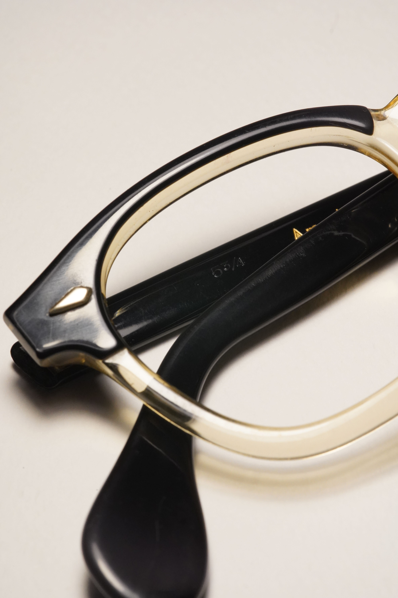

- #[[American Optical]]
- > Times only refer to the centerpiece of the frames.
  >
  > Original buyers could choose different temples from the store they're buying in, leading to many variations of the temples
- AO Times is a very popular [[Acetate]] prescription frames
- AO Times is believed to be produced during late [[1950s]] to [[1960s]]
- AO Times is believed to have had been AO's direct competition to [[TOE Arnel]]
- AO Times is believed to have been related to [[AO Modern Times]] and [[AO Jr. Modern Times]]
- # Features
	- 7-barreled hinges
		- 
	- [[AO Red Dot Screw]], round drive
		- 
	- Diamond front rivet
		- 
- # Photographs
	- ## Example 1
		- [[1950s]] two-tone black/clear Times, 44-22, with golden inlaid temples. **Note that the yellow hue is probably due to to the acetate aging**
		- 
		- 
		- This particular example just happens to have golden print 