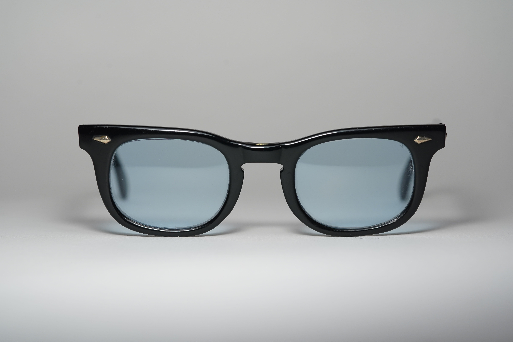
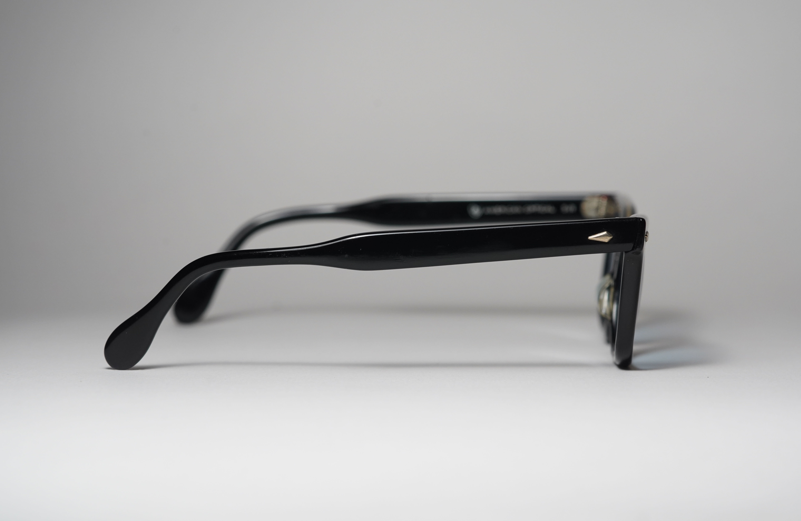
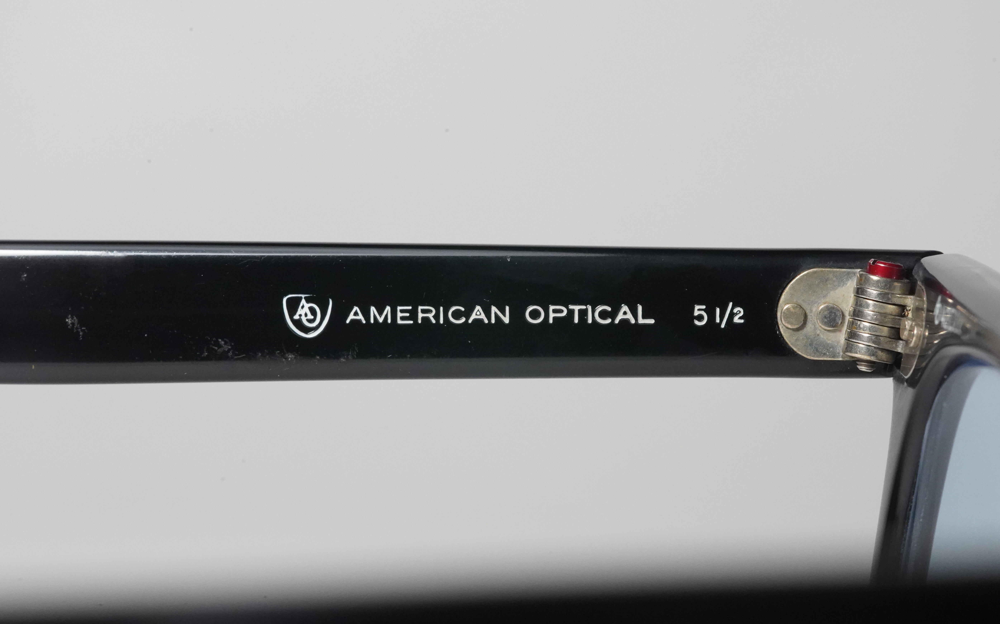
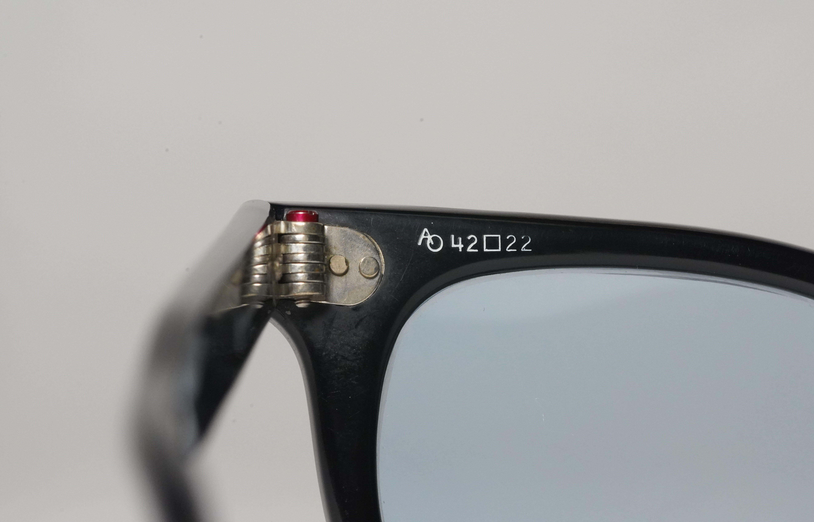
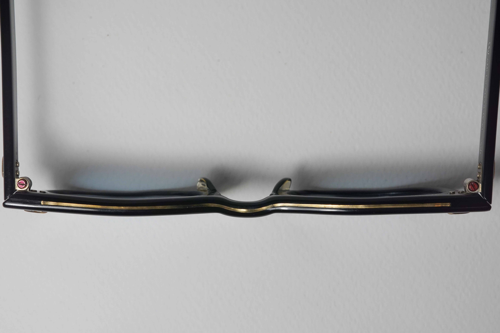
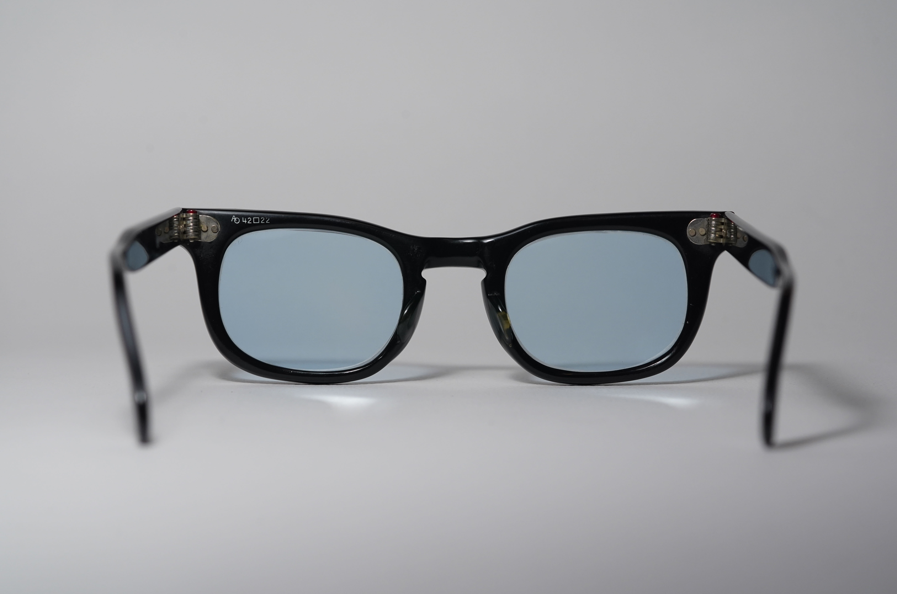
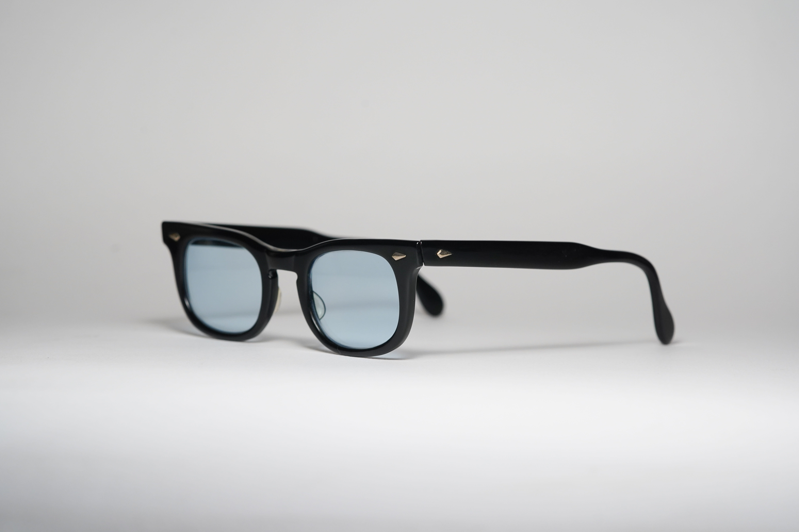
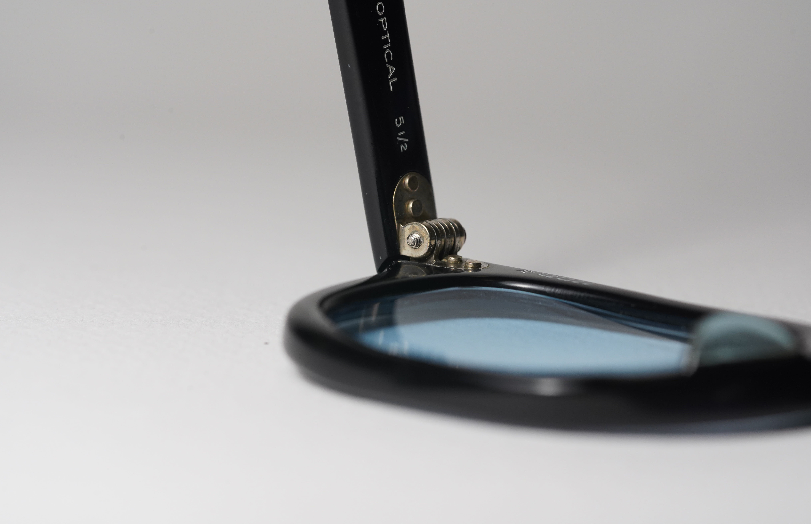
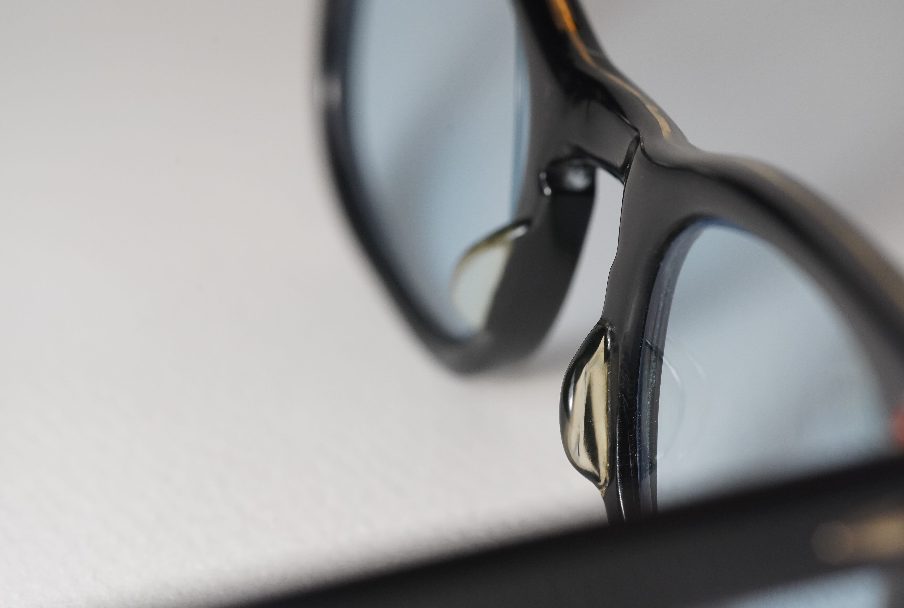

tags:: FrameModel
alias:: AO Rawhide
frame-manufacturer:: [[AO]] 
frame-origin:: [[US]] 
frame-era:: [[1960s]] 
frame-material:: [[Acetate]] 
frame-bridge:: [[keyhole]] 
frame-hinge:: [[7-barreled]] 
frame-temple:: [[Skull temple]] 
frame-rivet:: [[Diamond rivet]] 
frame-endpiece::

- 
  id:: 68127b09-3946-4523-adac-5f79e84988e2
- AO Rawhide is a children's rugged [ophthalmic]([[Ophthalmic]]) frames, with lens size ranging to from 36-42
- What made the Rawhide so cool is the fact that it has [braced front](((67f42cb0-e6f4-4b30-a169-5584a8ea2f06))) on the bridge of the frame
- > We believe the Rawhide was produced and sold during from #1960s onward due to its reinforced and rugged construction.
  >
  > [It also appears on 1963 brochures with no black color option](((67f42cb0-5985-41ed-91dc-930804819192))), suggesting that [the black example](((67f42cb0-7c0d-4022-a1ed-aefaf3b80f7e))) here is produced later than 1963
- # Features
  tags:: Features
	- ## [[Bridge]]
	  frame-bridge:: [[keyhole]]
		- {{embed ((68127b09-3946-4523-adac-5f79e84988e2))}}
	- ## [[Rivet]]
	  frame-rivet:: [[Diamond rivet]]
	- {{embed ((68127b09-3946-4523-adac-5f79e84988e2))}}
	- ## [[Temple]]
	  frame-temple:: [[Skull temple]]
		- 
	- ## [[Hinge]]
	  frame-hinge:: [[7-barreled]]
		- 
	- ## [[Identification]]
		- 
		- 
	- [[AO Red Dot Screw]] , slotted
		- 
	- ["Braced front" as reinforcement]([[Reinforcement]])
	  id:: 67f42cb0-e6f4-4b30-a169-5584a8ea2f06
		- 
- # #Photographs
	- ## Example 1
	  id:: 67f42cb0-7c0d-4022-a1ed-aefaf3b80f7e
		- A black Rawhide, with size 42-22-135
		- 
		- 
		- 
		- 
		- 
		- 
		-