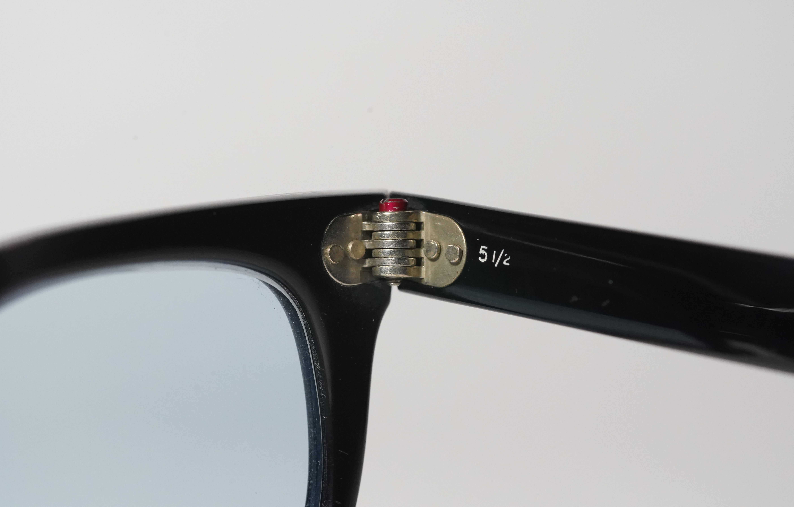
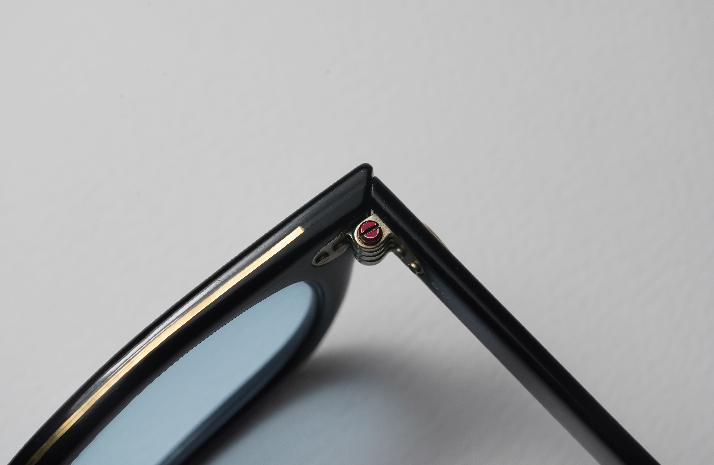
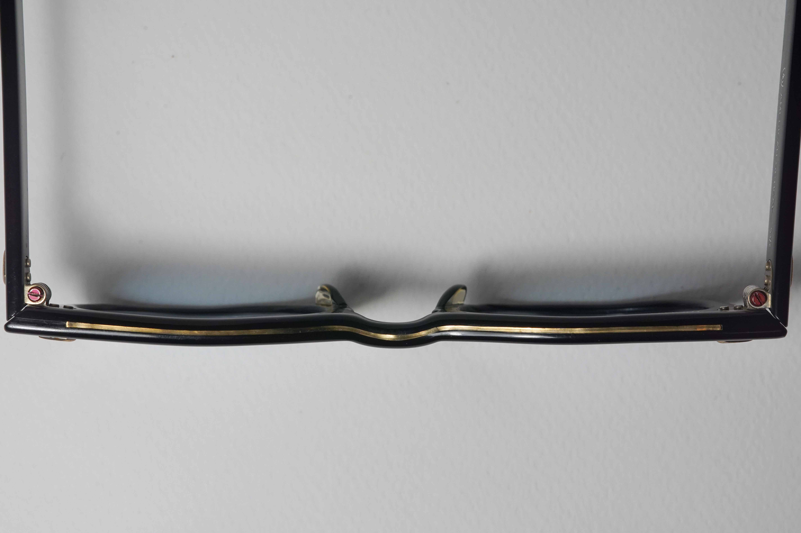
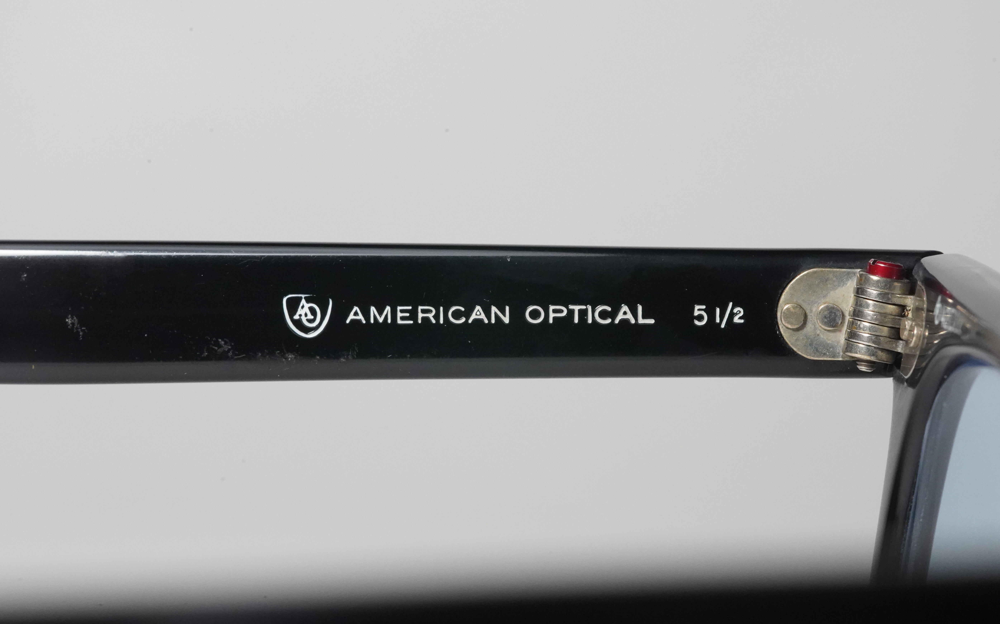
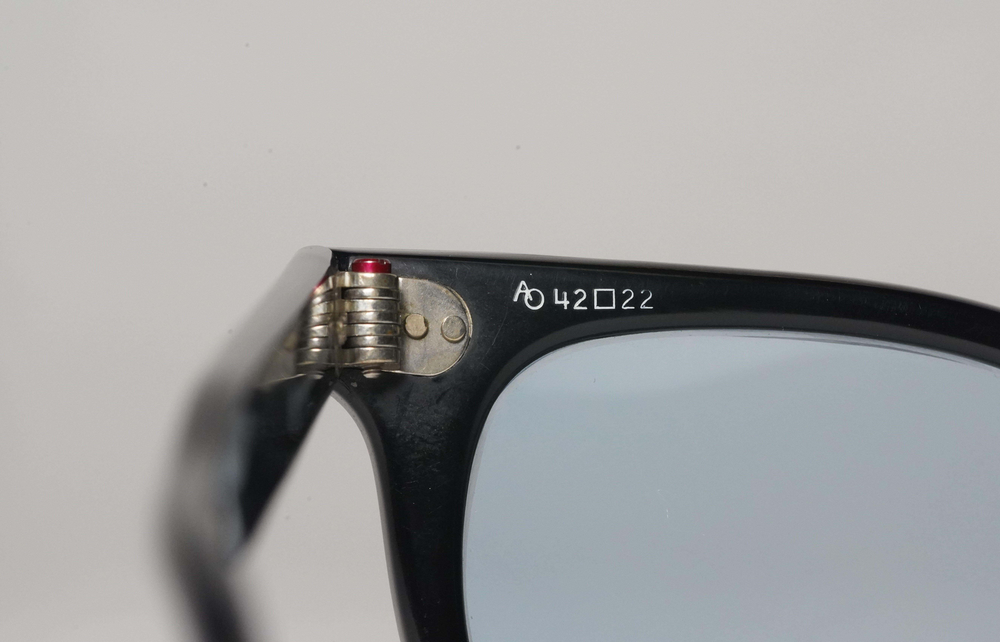
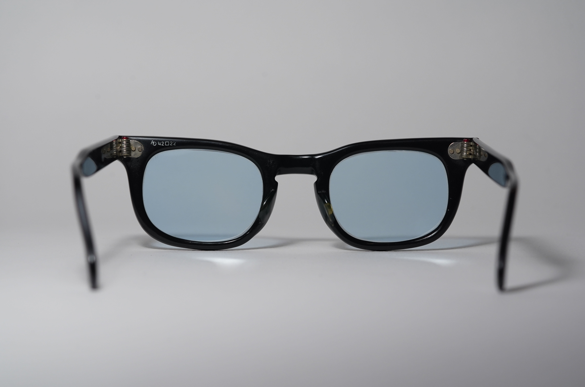
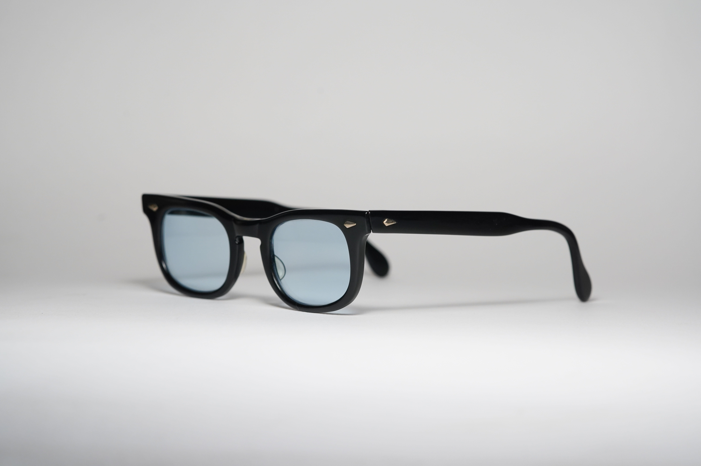
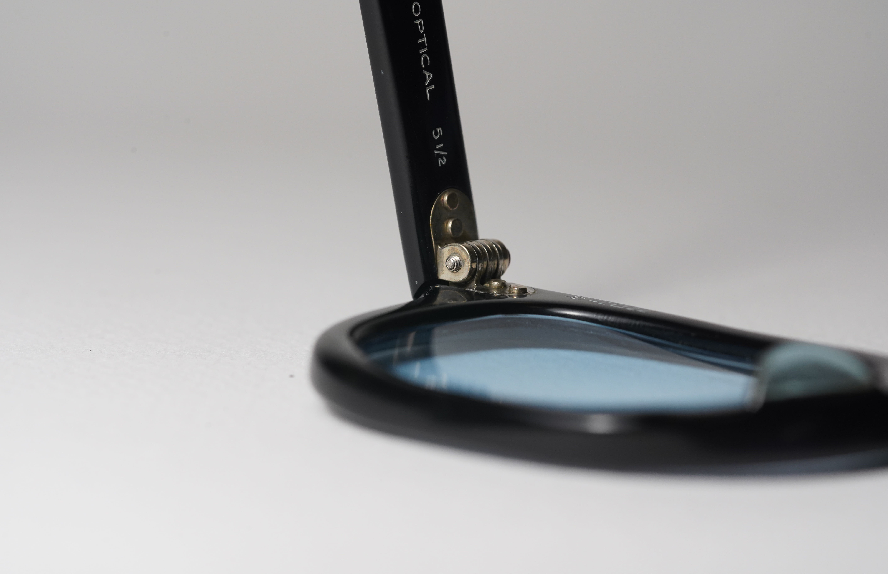
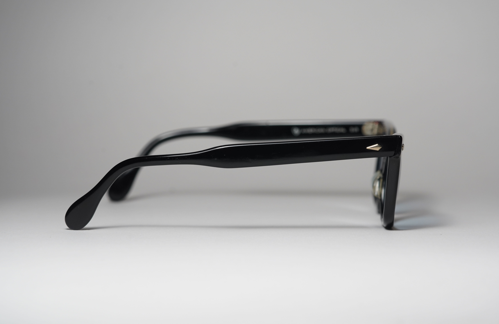
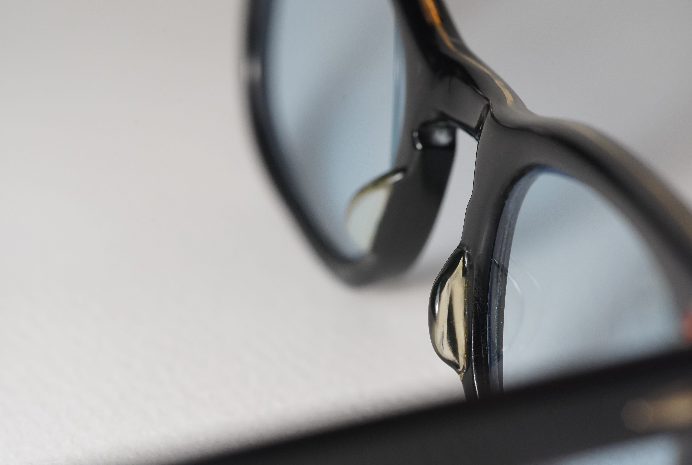

alias:: AO Rawhide

- #[[American Optical]]
- AO Rawhide is a children's rugged ophthalmic [[Acetate]] frames, with lens size ranging to from 36-42
- What made the Rawhide so cool is the fact that it has metal [[Reinforcement]] (braced front) on the bridge of the frame
- We believe the Rawhide was being sold during [[1960s]], due to its reinforced nature
- # Features
	- 7-barreled [hinges]([[Hinge]])
		- 
	- [[AO Red Dot Screw]] , slotted
		- 
	- "Braced front"
		- 
	- Screened/printed make and size
		- 
		- 
- # Photographs
	- Example 1: Black 42-22
		- 
		- 
		- 
		- 
		- 
		- 
		-