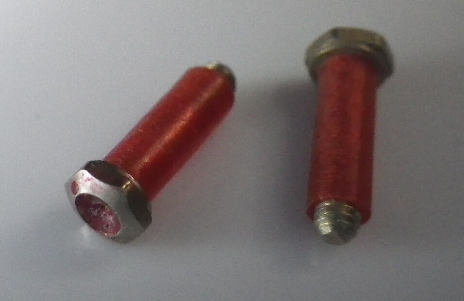
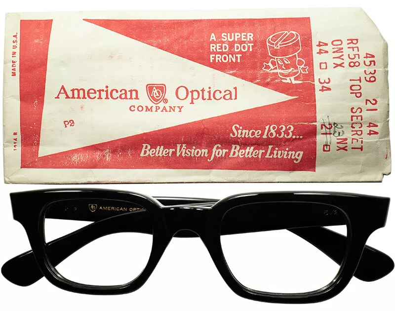
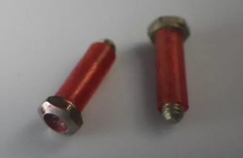
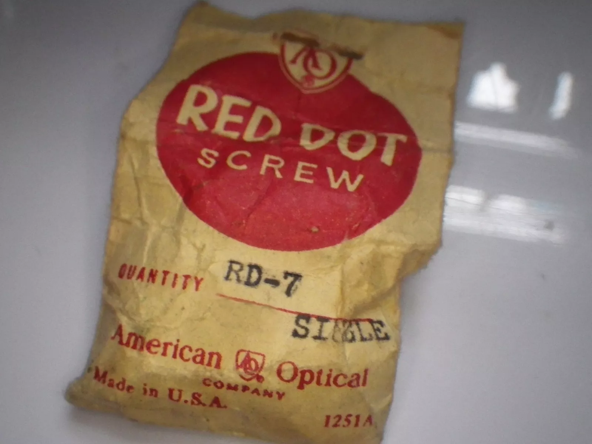
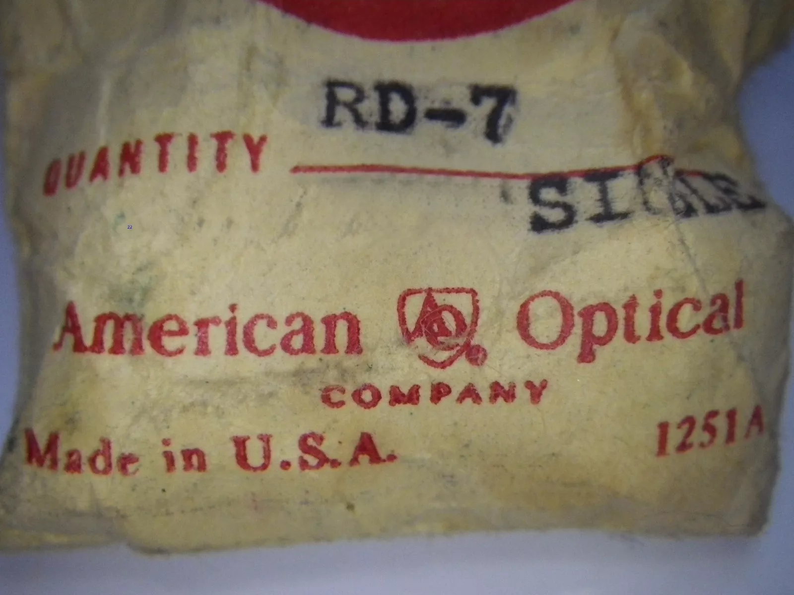

alias:: AO Red Dot Screw
#[[American Optical]] #1950s #1960s

- AO Red Dot Screws are special red-colored hinge screws most prevalently used by [[AO]] during #1960s
- > Not to be confused with [[American Optical Green Dot Screw]], used in [[AO Safety]] glasses
- The earliest mention of AO Red Dot was in in 1955
- > Although eyewear parts in the US is heavily standardized compared to in Europe, manufacturers could still slide a little innovation in there for a marketing and differentiation trick, like what Levi's did with the Arch and the Red Tab
- We started seeing red dots popping up in later #1950s, and then it became a staple during #1960s for pricier AO models.
- We haven't found the the red dot in any [[AO Safety frames]].
- # Variations
	- The most conspicuous place to determine variant of the Red Dot is most likely to be at the screw exposed head. A screw head will have some form of "driver", i.e. the place for the screwdriver to drive the screw in and out
	- ## Round drive
		- We found round red dots in older frames
		- We then assume that this is the original version of the red dot system.
		- It features a screw with rounded screw head and a rounded *driver*
		- 
	- ## Slotted drive
		- We found this variants in use more in #1960s frames
		- We then assume that this is the later variant
		- A NOS AO frame from #1960s [on sale on eBay](https://www.ebay.com/itm/286132140549)
		  
- # Reference text
	- > *American Optical Company announces that it’s new red dot program will be available nationwide very soon. This innovation, according to AO, has been acclaimed in the aereas where it has already been introduced.
	  >
	  > Red Dot, so called because of the identifying mark on each piece, provides a new means for fastening temples to fronts. It eliminates the problem of lost screws and loose temples, says the company, adding that proper tension at the hinge is assured for the normal life of the frame.
	  >
	  > The red dot mark is on a tubular rivet of new design and which incorporates a nylon bushing. A precision machine is supplied to seal the rivets in hinges that have been drilled and reamed. The machine will accommodate 3-, 5-, and 7- barrels, and assures the right amount of expansion of the bushing to guarantee a firm hinge tension that will not change with use.
	  >
	  > The machine also has a device for removal of the rivets if a change of temples is required.
	  >
	  > Only the newest AO frame will accommodate the new fastenings.  All new models being prepared by the frame division will use the red dots.*
- # #Photographs
	- From [eBay listing](https://www.ebay.com/itm/281975157212):
		- 
		- 
		- 
		- 