tags:: FrameModel
alias:: AO Times
frame-manufacturer:: [[American Optical]] 
frame-origin:: [[US]] 
frame-era:: [[1950s]] [[1960s]] 
frame-material:: [[Zylonite]] [[Acetate]] 
frame-bridge:: [[keyhole]] 
frame-hinge:: [[7-barreled]] 
frame-temple:: [[Skull temple]] 
frame-rivet:: [[Diamond rivet]] 
frame-endpiece::

- 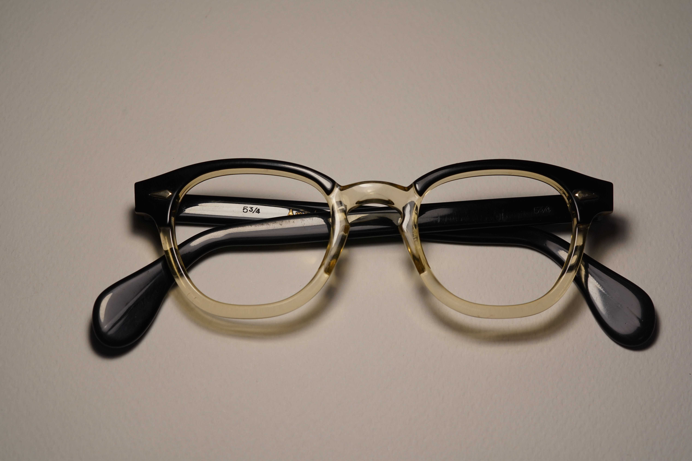
- AO Times is a very popular [acetate]([[Acetate]]) [ophthalmic]([[Ophthalmic]]) frame
- id:: 67f42cb0-b344-4833-a00f-97864ddd2135
  > *Times* only refer to the centerpiece of the frames.
  >
  > At that time original buyers could choose different temples from the store they're buying AO Times in, leading to many variations of the temple combination
- AO Times is believed to be produced during late #1950s to #1960s
- AO Times is believed to have had been AO's direct competition to [[TOE Arnel]]
- AO Times is believed to have been related to [[AO Modern Times]] and [[AO Jr. Modern Times]]
- # Features
  tags:: Features
	- Note that temples are not featured, because there're too many variations
	- ## [[Bridge]]
	  frame-bridge:: [[keyhole]]
		- 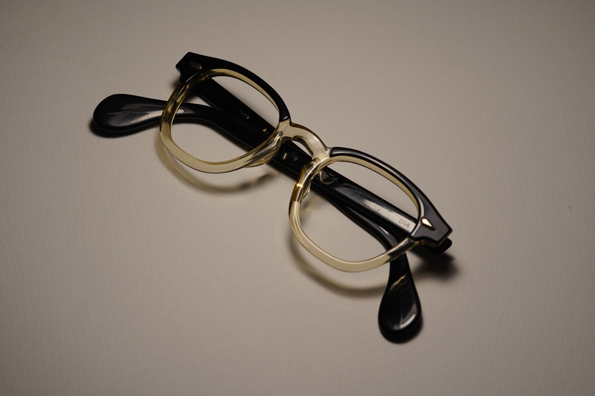
		- 
	- ## [[Hinge]]
	  frame-hinge:: [[7-barreled]]
		- [Example 1](((67f42cb0-0a67-4af5-9a26-8305758bcc2d)))
		  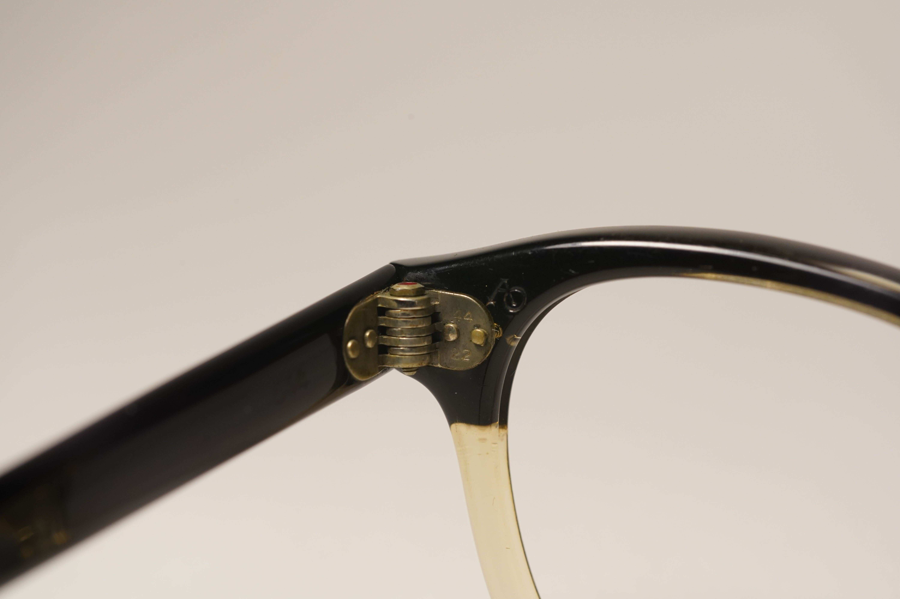
		- [Example 2](((67f7b387-3887-48f6-bbf8-1752f93c4c0e)))
		  
	- ## [[Rivet]]
	  frame-rivet:: [[Diamond rivet]]
		- [Example 1](((67f42cb0-0a67-4af5-9a26-8305758bcc2d)))
		  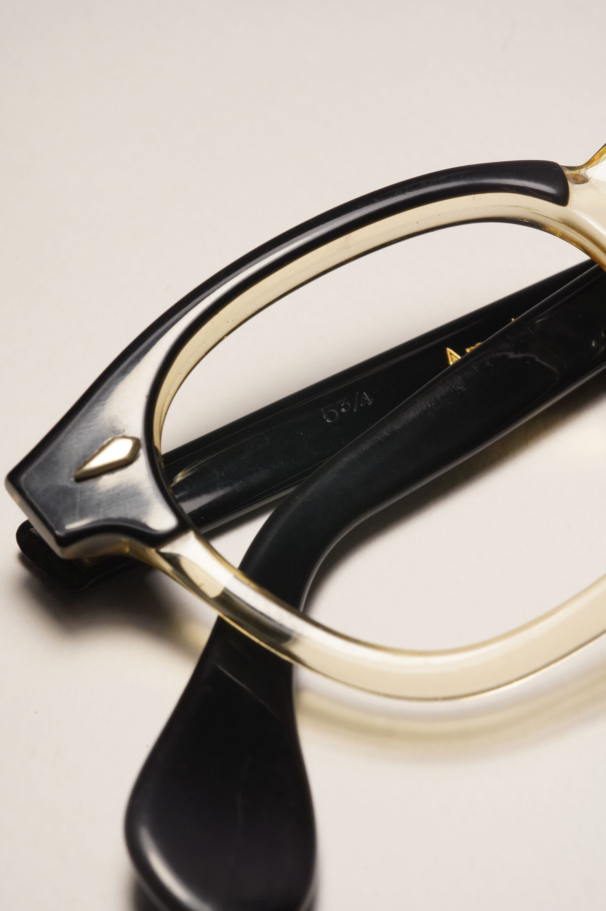
		- [Example 2](((67f7b387-3887-48f6-bbf8-1752f93c4c0e)))
		  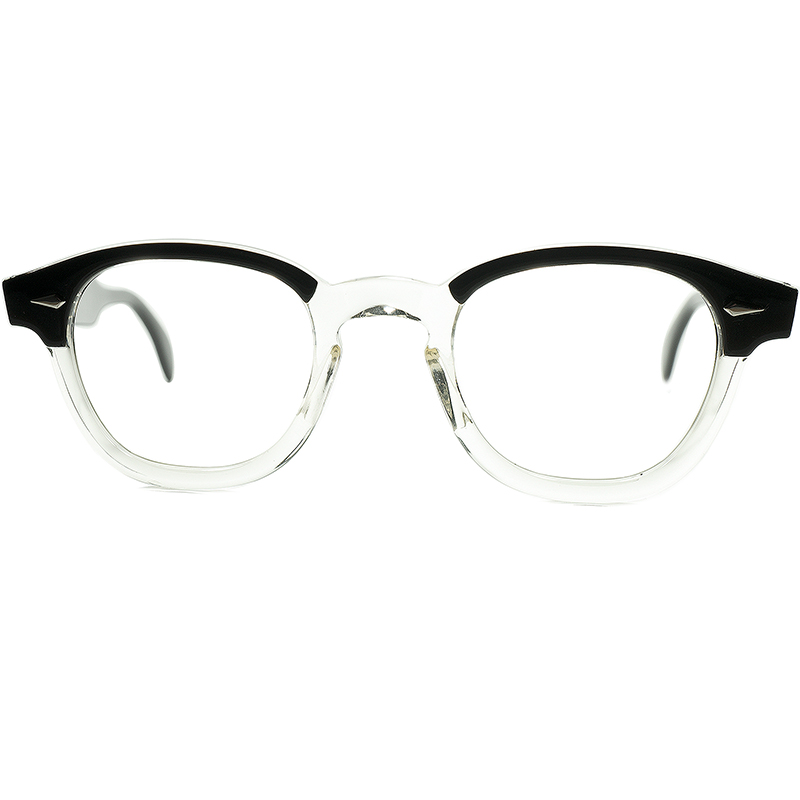
	- [[AO Red Dot Screw]] , round drive
		- [Example 1](((67f42cb0-0a67-4af5-9a26-8305758bcc2d)))
		  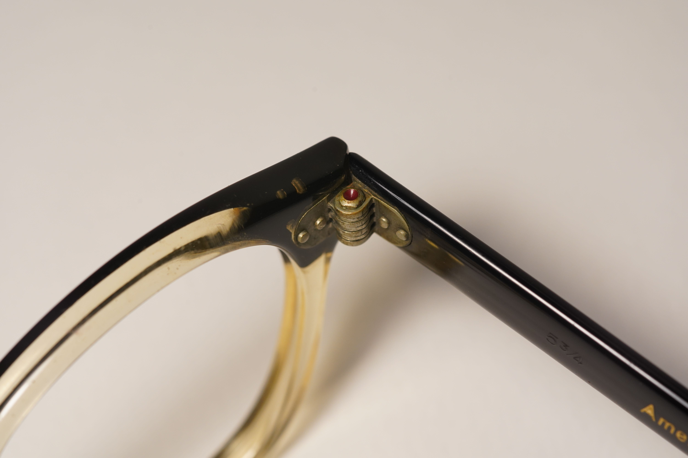
- # #Photographs
	- ## Example 1
	  id:: 67f42cb0-0a67-4af5-9a26-8305758bcc2d
		- Two-tone black/clear Times, 44-22, with golden inlaid temples #1950s
		  > Note that the yellow hue is probably due to to the acetate aging
		- 
		- 
		- This particular example just happens to have golden print 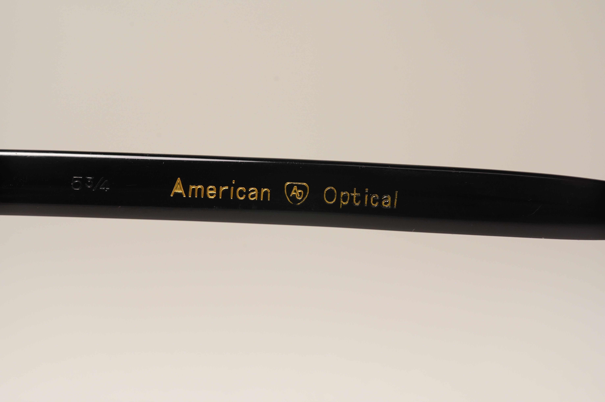
	- ## Example 2 (from [gig-lamps](https://www.gig-lamps.com/home/1960s-american-optical-times-2tone-black-size-44-22/))
	  id:: 67f7b387-3887-48f6-bbf8-1752f93c4c0e
		- Two-tone black/clear Times, 44-22, with temples looking similar to [[SRO 820]]
		- {{embed ((67f42cb0-b344-4833-a00f-97864ddd2135))}}
		- 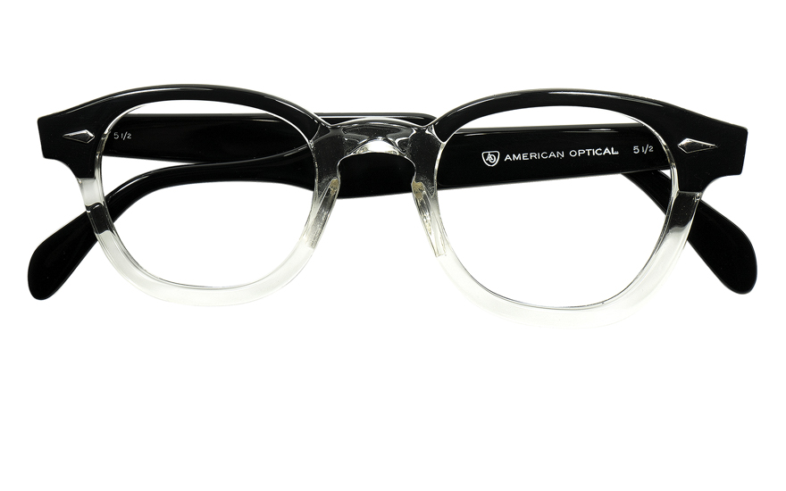
		- 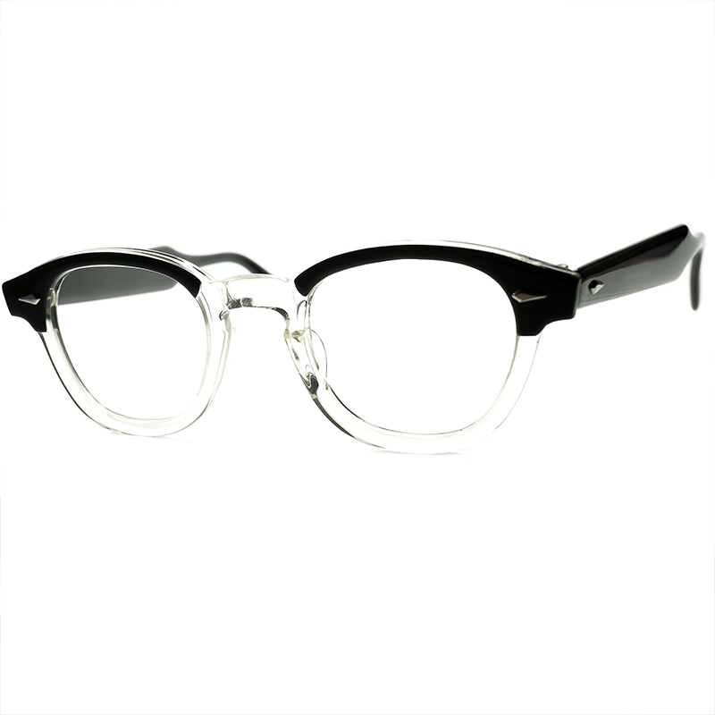
		- 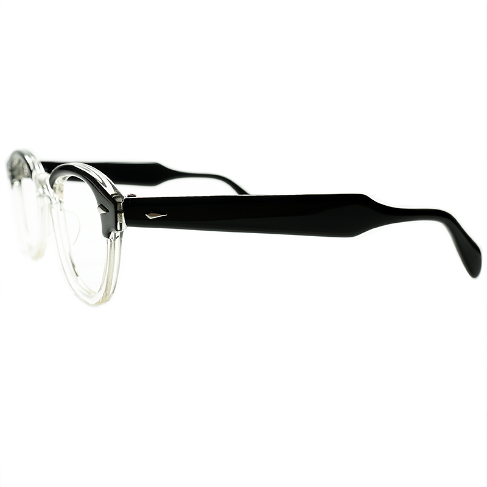
		- 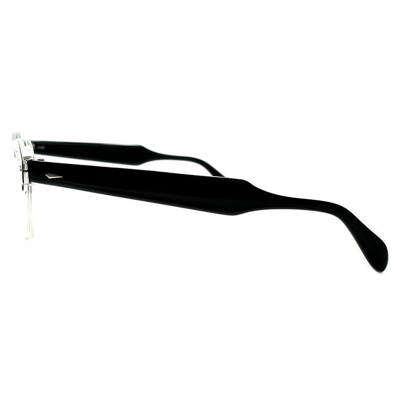
		- 