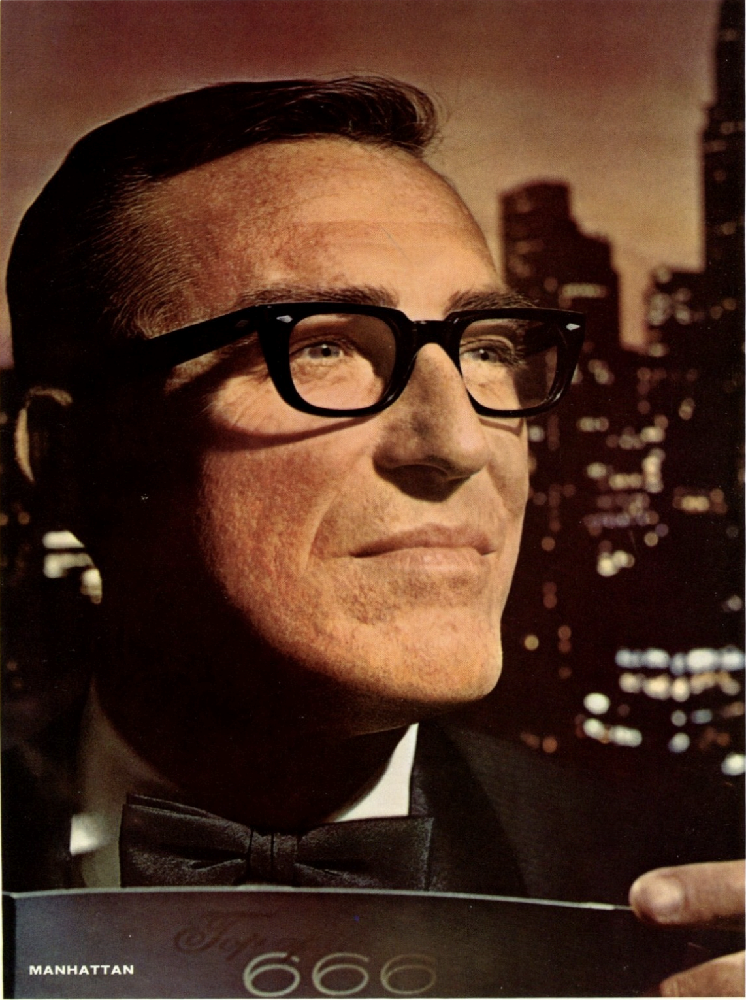

alias:: [[AO]]

- > See also: [Wikipedia](https://en.wikipedia.org/wiki/American_Optical_Company)
- American Optical (AO) is an American manufacturer with a very long history and even longer list of product portfolio.
- # History
	- > See also: [Very detailed AO history by former worker]([[AO event logs]])
	- The American Optical Company (AO) was founded way back in 1833, producing lenses
	- AO supplied glasses, goggles, and gunsights for troops during WW1 and WW2, and continued to supply the American military post-war
	- Starting in 1980s, AO owners began divesting, making company rot slowly with factories closed
	- ## AO in Canada (AOCOC)
		- > Reference: https://omeka.uottawa.ca/instrument-precision/items/show/29
		- Consolidated Optical Company was a Canadian company founded in 1907 and largely based in and around Toronto
		- Consolidated had factories in Toronto, which was demolished
			- {{video https://www.youtube.com/watch?v=fOgYUYAAPHc}}
		- AO later bought Consolidated, and change the company name to American Optical Company of Canada (AOCOC)
- # Frames (prescription)
	- [[AO Times]]
	- [[AO Rawhide]]
	- [[AO Manhattan]]
	- [[AO Saratoga]]
	- [[AO Stadium]]
	- [[AO Tournament]]
- # Frames (safety)
	- [[AO Z87]]
- # 1963 Brochures
	- > Brochures here are captured from PDF scans, from [Dick Whitney](https://dickwhitney.net)
	- [[AO Rawhide]]
		- 
		- 
	- [[AO Manhattan]]
		- 
		- 
	- [[AO Modern Times]]
		- 
	- [[AO Jr. Modern Times]]
		- 
		- 
	- [[AO Cataract Men's]]
		- 
	- [[AO Jaguar]]
		- 
- # External resources
	- > These resources are not compiled into the Wiki, and may be stale
	- [[AO workers and factories]]