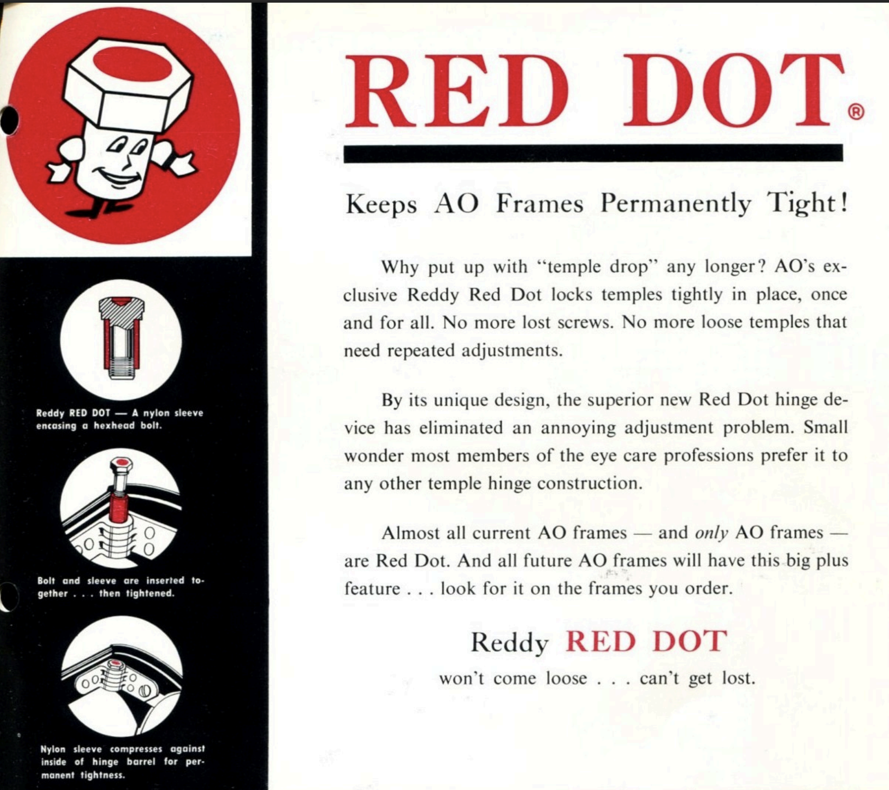
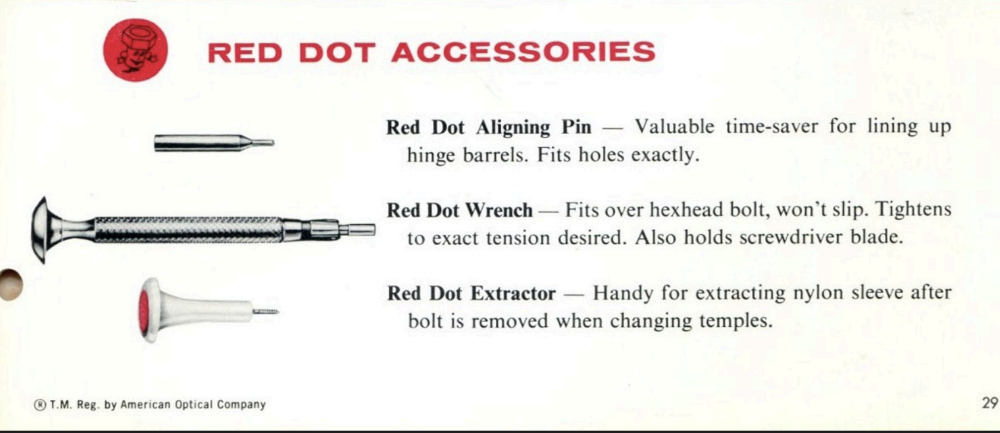

tags:: Manufacturer
alias:: AO
origin:: [[US]]
active:: false
since:: 1833
until:: [[1990s]]

- > See also: [Wikipedia](https://en.wikipedia.org/wiki/American_Optical_Company)
- American Optical (AO) is an American frame manufacturer with a very long history and even longer list of product portfolio, covering everything from simple eyeglasses, sunglasses, to other safety wear and precision instruments
- # Frames
	- [[American Optical Times]]
	- [[American Optical Rawhide]]
	- [[American Optical Manhattan]]
	- [[American Optical Saratoga]]
	- [[American Optical Stadium]]
	- [[American Optical Tournament]]
	- [[AO Safety Z87]]
- # Misc
	- [[American Optical Red Dot Screw]]
	- [[American Optical Green Dot Screw]]
	- Era identification from temple markings, from vintage seller [@krabeemarn](https://instagram.com/krabeemarn) #1950s #1960s #1970s
		- 
- # History
	- > See also: [Article from Optical Heritage Museum](https://www.opticalheritagemuseum.com/learn/va/aohistory)
	- What would become American Optical Company was founded way back in 1833, starting with [silver frames]([[Silver]])
	- AO supplied glasses, goggles, and gunsights for troops during WW1 and WW2, and continued to supply the American military post-war, and even helped with [Apollo 11 program](https://en.wikipedia.org/wiki/Apollo_11)
		- AO advertised in 1970 that it invented the **First Sunglasses on the Moon**, much like what Omega was doing with their Speedmaster Professional chronograph
	- Starting in 1980s, AO owners began divesting, making company rot slowly with factories closed
	- ## [[AO Canada]] (AOCOC)
		- > Reference: https://omeka.uottawa.ca/instrument-precision/items/show/29
		- Consolidated Optical Company was a Canadian company founded in 1907 and largely based in and around Toronto
		- Consolidated had factories in Toronto, which was demolished
			- {{video https://www.youtube.com/watch?v=fOgYUYAAPHc}}
		- AO later bought Consolidated, and change the company name to American Optical Company of Canada (AOCOC)
	- ## [[AO Safety]]
		- AO Safety in FrameDB refers to non-ophthalmic frames for safety, e.g. for protective [safety goggles]([[Safety eyewear]]) for factory workers and military personnel
		- In the early days (pre 1940s), [sunglasses]([[Sunglasses]]) were still considered AO Safety products
		- [[AO Canada]] also produces [[AO Safety]] products
		- As of now, AO Safety has become integrated into [Aeaero, a 3M subsidiary](https://www.aearotechnologies.com/)
		- AO Safety *firsts* (courtesy of [Dick Whitney](https://www.dickwhitney.net/AOSafetyFirsts.pdf))
			- First Safety Goggles
			- First Heat Tempered Glass Lens (added impact resistance lens strength)
			- Invented Calobar and Cruxite absorbtive glass
			- Fulvue Frame (first with temples attached at the top)
			- Executive Bifocal Safety lens
			- Invented Calobar and Cruxite absorbtive glass
	- ## AO logo history
  | Introduction | Logo |
  | :-: | :-: |
  |     1885     |   |
  |     1889     |   |
  |     1911      |   |
  |     1929     |   |
  |     1943     |   |
  |     1959     |   |
  |     1965     |  |
  |     1973     |   |
  |     1983     |   |
  |     1995     |   |
	- ## Full history: 1800s
	  id:: 67f532be-a5bc-4b28-bf31-fb1530cd220f
		- > Summarized from [The American Optical Company: A History](https://www.opticalheritagemuseum.com/learn/va/aohistory) by Diane Matuck
		  >
		  > See also: [Very detailed AO history by former worker]([[AO event logs]])
		- **1826**: **William Beecher** set up a watch and jewelry shop in **Southbridge, Massachusetts**
			- 
		- **1833**: Proto-AO was established in Beecher's shop upstairs workspace
			- Beecher had seen British spectacles, and knew he could do better
			- [Early Beecher spectacles were made with silver]([[Silver]]), reflecting Beecher's legacy as a jeweler
				- 
			- Beecher had hired 7 workers, who were able to put out 1 pair per day per worker
		- **1839**:  Beecher sold jewelry shop to apprentice **Robert Cole**, and moved proto-AO to new factory
			- Beecher sold the jewelry business (to focus more on AO) to Robert Cole, his first apprentice jeweler.
			  
			- Beecher then moved his spectacle business to the first factory **the Old Spec Shop** on lower Main Street, also in Southbridge, Massachusetts
			  id:: 67f536cf-b236-409b-845e-803b836a546b
			  
		- **1840**: Beecher sold proto-AO to Ammidown
			- The business was sold to **Holdridge Ammidown** and **Jairus Putney**, and later became **Ammidown & Son**, then **Ammidown & Co**
			- Though Beecher remained briefly after the sales to teach Ammidown’s son Lucius
			- Note that Holdridge Ammidown is related to both Beecher and Cole:
				- Related to Beecher, who married Ammidown’s sister
				- Related to Cole, who married Ammidown’s daughter
		- **1843**: Proto-AO began selling [frames made of US steel]([[Steel]]) - a cheaper material compared to silver
		- **1851**: Beecher reentered spectacles business with Cole as **Beecher and Cole**
			- By 1852 Beecher and Cole produced a total of 14,919 pairs of silver, steel, and gold spectacles
		- **1862**: Beecher retired, and their company became **Robert Cole & Co**
		- **1864**: **George Washington Wells** joined Cole, and excelled at metal frame-making
			- Wells later went on to apply his knowledge to other industries, earning him multiple patents
			- 
		- **1864-1869**: Wells bought another Southbridge-based frame making company from Henry Ammidown and Charles Edmonds
			- Cole tried to convince Wells to join Cole as partner, but that failed
			- Cole wanted Wells because he was very innovative - innovating new machines to help with productions one after the other
		- **1869**: The **American Optical Company** was established from merger of Cole's and George's companies
			- $40,000 capital
			- 400 shares
				- Cole (now President) owned 150
				- Wells owned 40
			- 85 employees
		- **1872**: Wells bought Central Mills for a new factory
			- This was around the time Southbridge was pivoting from a textile mill town to optical manufacturing town
			- Located at Main and Mechanic Street near the [Old Spec Shop](((67f536cf-b236-409b-845e-803b836a546b)))
			- 
		- > During this time, AO only produced frames. Lenses were still bought from [European cottage industry](https://en.wiktionary.org/wiki/cottage_industry)
		  >
		  > For some context - lens customers around this time would first need to try on pre-made *spherical lenses* and choose what served them best.
		  >
		  > This meant that astigmatism customers were not well served at the time
		  >
		  > Also, the Wells are very close to [the Lombs]([[Bausch and Lomb]]), and they both went to DC together to lobby for the continuation of tariffs on imported glass
		- **1884**: AO hired lens expert Charlie Wilson #lens
			- After a year of trial and error, AO finally successfully made spherical lenses from imported lens blanks
			- This helps expanded the business very aggressively since it cut lead time for finished European lenses, which was usually a year long
			- Flat biconcave and biconvex lenses were replaced by AO’s first production lens, the Centex
			- AO supplied not only white glass, but also blue, smoked, amber, pink, amethyst, and eupos
		- **1887**: AO made 1.5 million pairs of spectacles and employed 400 people
			- This increase was mainly due to electricity taking over as power source, replacing water
		- **1890**: Cole retired as president, with Wells replacing him
			- Wells was later joined by his sons Channing, Albert, and Cheney in the 1890’s
			- Channing Wells
			  
			- Albert Wells
			  
			- Cheney Wells
			  
		- **1893**: AO became the world's largest, with 2 millions frames produced and 800 employees
			- The workforce was mostly Francophone immigrants from Canada, who just immigrated to Southbridge
		- ## AO *firsts* by 1800s
- | Year | Event |
  | :-- | --: |
  | 1874 | Rimless spectacles |
  | 1883 | The first lens plant |
  | 1884 | Trial frames |
  | 1891 | Automatic lens edgers and gold-filled spectacles |
  | 1895 | Eyeglass chains |
  | 1898 | Eyeglass cases |
  | 1900 | Toric lenses |
	- ## Full history: 1900s (WIP)
	  id:: 67f54216-e289-4f00-8898-15427ef99b53
		- > Note: Between 1911-1927, the trademark `Wellsworth` was used and became some what better known compared to AO. This led AO to try to bring more attention to its marketing names
		  
		- **1905**: International division established in London
			- AO later expanded overseas to [Canada]([[AO Canada]]), Brazil, and Germany
			- AO also expanded US operations to New York, Chicago, and San Francisco
		- **1907**: Automobile introduction prompted AO to produce driving goggles
		- **1912**: George Wells died and his sons took over
			- Channing became President and focused on sales
			- Cheney became VP and did R&D
			- Albert was overseeing operations and finances
		- **1917**: The Wells bought remaining shares from the Coles, consolidating ownership into the Wells family
		- **1910**: AO got a license to produce John Borsch’s fused *Kryptok* bifocal and one-piece *Ultex* bifocal lenses
			- Kryptok comes from krypt (hidden) + tok (eye), which signifies its near-invisible bifocal
			  
		- **1910**: AO continued to expand, and built a new lens factory *Lensdale* behind the main plant
			- Lensdale was the largest US concrete building at the time
			- 
		- [[WW1]] developments
			- 1/3 of staff was called up to serve
			- 100-350 staff was sick because of the Spanish Flu (1918)
			- 1/3 of lens production, along with goggles and other equipment was shipped to Britain
			- These shipments are meant to be used by troopers, pilots, mobile bases, field hospitals
		- **1916**: AO hired **Edgar Tillyer** from the Bureau of Standards as R&D head
			- Edgar Tillyer
			  
			- This was around the time [[B&L]] started selling *corrected curve lens* **Punktal**, which was very popular
			- AO might possibly just want to compete with B&L Punktal lens
			- In 1925, AO successfully introduced Tillyer's corrected curve lens
			- AO later hired Anna Estelle Glancy (math god) to Tillyer with his calculations
			  
			- Tillyer would go on to claim 165 US patents and 32 Canadian patents, while Glancy was credited with a patent for the first progressive lens design in 1924
			- Tillyer worked during [[WW1]] designing scopes and gunsights for US military, working on optical components of many war machines like the submarine telescopes, tank telescopes, and bomber's bomb site telescopes
			- Tillyer later contributed his glass formulations to the Manhattan project in [[WW2]]
		- **1917**: Tillyer patented a new type of Calobar
			- This new Calobar lens **blocks both infrared and UV light**, becoming de facto standard [sunglass]([[Sunglasses]]) for the armed forces prior to [[WW2]]
		- **1917**: AO patented the [Windsor]([[American Optical Windsor]]) frame
			- An influential round frame, frequently infringed upon
			- 
		- **1920s**: Post-war developments
			- **1920**: AO patented the [Lensometer](https://www.opticalheritagemuseum.com/explore/feature/lensometer), a mechanical optical device used to determine the lens's spherical and cylindrical power
				- 1921 AO Lensometer
				  
			- AO introduced *Nokrome* and *Cruxite* glass, Polaroid lenses combined with Calobar glass as a superior sunglass lens
			- **1925**: The influential **Tillyer's Lens** is introduced
				- The lens enlarged the area of the prescription optical power of a lens
			- Acquisitions in 1920s
				- AO bought 14 optical companies with branches in 119 cities to help with the distribution efficiency
					- **Julius King Company**, including their Industrial Eye Protection Division
						- Relocated to Southbridge
						- This later became a very important division
					- **Globe Optical Company** (Boston retailer)
						- Bought 12 branches from the
					- **DeZeng Instrument Company** in New Jersey
						- Acquiring DeZeng in 1925 allowed AO into scientific precision instrument market
					- **Spencer Lens Company** in New York
						- The microscope maker later became AO's Scientific Instrument Division
						- AO microscope
						  
				- AO also recruited execs of the acquired companies to join the company
				- After the acquisitions, AO now has operations in both wholesale and retail, as well as expanded manufacturing capabilities, even expanding into new market like telescopes
				- After the acquisitions, AO now operated more like a network of branch offices scattered across the country
				  
			- **1926**: AO began offering [[Zylonite]] frame in [[AO Windsor]] model in black, wine and demi amber
				- 
		- **1930**: AO introduced the [[AO Fulvue]] frame!
		  id:: 67f55aae-cb64-451c-8bca-1bf213a7df3b
			- This *full-view* frame positioned the endpieces closer to the top of the frame rather than at midpoint
			- This paved way for the positioning of today's generic ophthalmic glasses
			- 
			- During this period, a monopolistic conspiracy was suspected in AO
				- In addition to super popular Ful Vue, AO was also asked by 2 other designers to collect royalty on their behalf
					- Bay State Optical -> Rimway frame
					- Uhlemann Optical Company -> Numont frame patent
				- This granted AO the power to control the market, and would later come back to bite AO in the ass
		- **1933**: then-100-year-old AO had 17.5 acres of floor space in 36 buildings
		- **1936**: Albert's son George B. Wells took over his uncle Channing as President
		- [[WW2]] developments
			- AO was limited by raw materials, so they decided to sell less frame styles - only focusing on successful, profitable designs
			- AO signed up with the Vision for Victory program
				- 18 million pairs of lenses
				- 5 million pairs of [sunglasses]([[Sunglasses]])
				- 10 million goggle frames
				- A lot of ophthalmic equipment and instruments
			- Women filled in the vacant positions left by enlisted male workers to keep the production capacity
			- Mobile Optical Units  as forward/field repair unit
				- MOUs allowed the fielded army to repair spectacles very close to the frontline
				- Conceived 1941, rolling out of Southbridge 1942
				- 
				- 
			- AO Monoplex Plastic Artificial Eyes
				- Glass prosthetics eyes were in shortage
				- But glass eyes are bad because it could shatter
				- AO initiated the *Monoplex Plastic Artificial Eye Division* with 15 artists, and supplied the demand for unbreakable artificial eyes made from methyl methacrylate
				  
		- 1940s US law suits
			- AO was sued by the US government for monopoly
			- The charges were in motion since [[WW2]], but was delayed because US also needed AO to be at full capacity for the war efforts
			- The 1st charge was against [AO fixing prices of popular frames](((67f55aae-cb64-451c-8bca-1bf213a7df3b)))
			- The 2nd charge destroyed a payment system that allows AO to rebate eye doctors when purchasing AO lens. It also barred AO from lens dispensing for the next 10 years
			- The 3rd charge prohibited AO and [[B&L]] from retail business for 5 years, and from opening more than five new wholesale labs a year
			- These lawsuits greatly removed AO and [[B&L]] financial advantages in the industry, paving ways for smaller companies to catch up while leaving the 2 big players burdened with outdated machinery
		- **1946**: **Charles Cozzens** took over as President, a first non-Wells
		- **1947-1949**: Leadership turmoil
		- **1951**: AO became publicly traded on NYSE after New Deal changed the taxation landscape. The Wells family firm ownership was no more
- # #Photographs
	- Gemini 5 astronauts wearing AO [sunglasses]([[Sunglasses]]) in 1965 #1960s
		- 
- # 1963 Brochure
	- > Brochures here are captured from PDF scans, from [Dick Whitney](https://dickwhitney.net)
	- [[American Optical Red Dot Screw]]
		- 
		  id:: 67f42cb0-ec15-4e07-8295-8a4c96b3e693
		  
	- [[American Optical Rawhide]]
	  id:: 67f42cb0-5985-41ed-91dc-930804819192
		- 
		- {:height 967, :width 718}
	- [[American Optical Manhattan]]
		- 
		- 
	- [[American Optical Modern Times]]
		- 
	- [[American Optical Jr. Modern Times]]
		- 
		- 
	- [[American Optical Cataract Men's]]
		- 
	- [[American Optical Jaguar]]
		- 
- # Brochures and other prints
	- 1916 [[AO Safety]] brochure
		- Courtesy of [Dick Whitney](https://www.dickwhitney.net/AOHistorySafety.html)
		  
	- 1943 [[AO Safety]] lenses weathering tests
		- Courtesy of [Dick Whitney](https://www.dickwhitney.net/AOHistorySafety.html)
		  
	- 1944 [[AO Safety]] products on the front page of *Scientific American*
		- Courtesy of [Dick Whitney](https://www.dickwhitney.net/AOHistorySafety.html)
		- 
		- 
	- 1948 [[AO Safety]] sunglasses, advertising [Calobar lens](https://aoeyewear.com/lens-technology/?srsltid=AfmBOoqaOxpfz2yeRF7m98PZEsL_8ehSmWDfp8z_C3iYY7vBYZuyxt72)
		- Courtesy of [Dick Whitney](https://www.dickwhitney.net/AOHistorySafety.html)
		  
	- 1948 AO S-1000 cover featuring [[AO Safety]] polycarbonate safety goggles
		- 
	- 1950s AO print ads featuring [[AO Red Dot Screw]]
		- 
	- 1965 NASA recognition for AO contribution
		-  Michael Collins
- # External resources
	- > These resources are not compiled into the Wiki, and may be stale
	- [[AO workers and factories]]