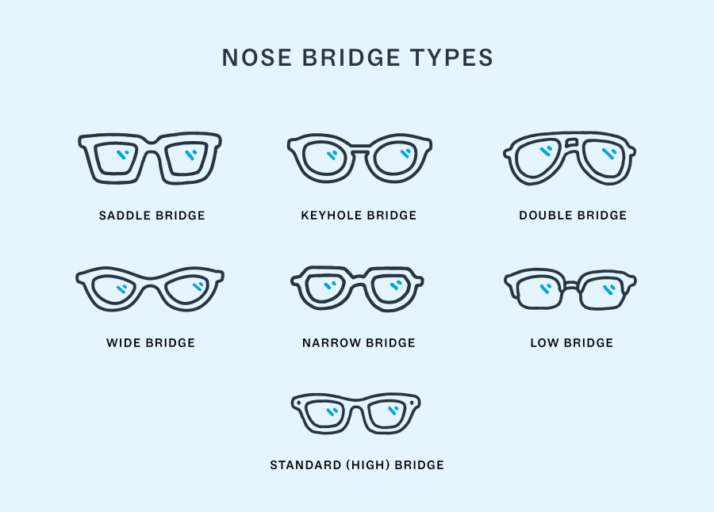

- #Frame
- The bridge connects the left eye wire to the right one
- 
- # Styles
	- [[Keyhole bridge]]
		- First used because it gives *increased nasal cutaway*
		- This makes the frames more forgiving when fitting
	- [[Standard bridge]]
	- [[Low bridge]]
	- [[Double bridge]]