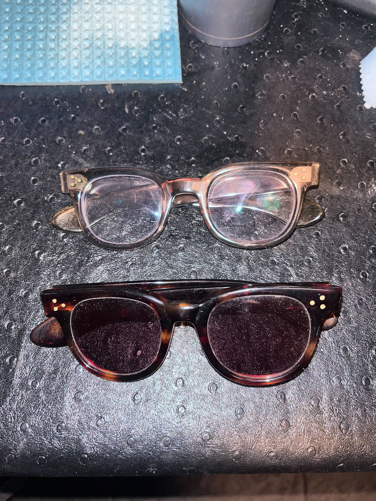
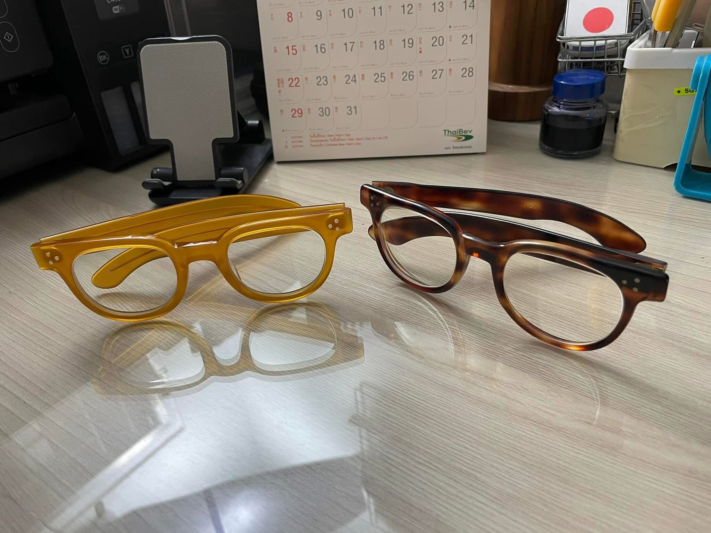
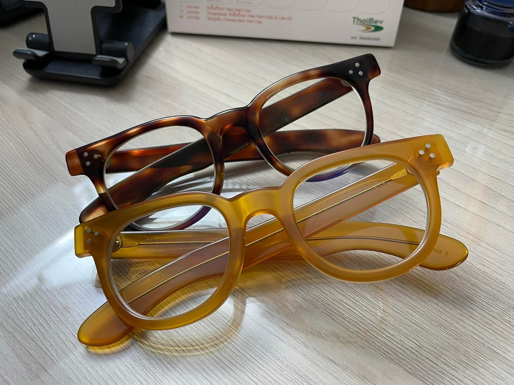

alias:: FDR

- FDR-style frames are popular American frame family from [[1950s]] and [[1960s]]
- It seems to be very popular among powerful men due to its bold looks
	- It's very popular back then, and even brought back in period films like A Complete Unknown, where it was worn by multiple characters who are depicted as those further up the food chain
- Modern companies like Julius Tart still manufactures and sells this frame
- # Unmarked frames
	- We believe the FDR frames were so popular that all manufacturers rushed to produce them to capture the market share
	- This led to many "prototypes" or unrefined versions among the examples
	- These examples usually lack manufacturer names, and most likely will only say `USA`, `Made in USA`, or `Handmade in USA`
- # Features (in all frames)
	- 3-dot front rivets, with 3-dot temple rivets
	- Finished (smoothed) rivets
	- Spatula temples
		- In older frames (i.e. from [[1950s]]), the spatula temples might be unreinforced
		- Later frames (i.e. from [[1960s]]) and the reproductions (e.g. [Julius Tart](https://www.juliustartoptical.com/fdr24.html)) usually come with reinforced temples:
		  
- # Photographs
	- [SRO-made FDR-style]([[Styl-Rite Optical FDR-style frame]]) and an unmarked frame
		- The unmarked frames are stamped `USA 6`, with 6 probably referring to the temple length in inches
		- 
	- [Courtesy of a Thai Facebook group: ชุมชนแว่นวินเทจ](https://www.facebook.com/groups/1761255333918207)
		- Julius Tart reproduction in honey yellow, and unmarked vintage unreinforced FDR-style frames.
			- 
			- 
		- Black and clear frames, both worn by Gary Oldman (unknown make/model)
			- 
			- 
			- 
			- 