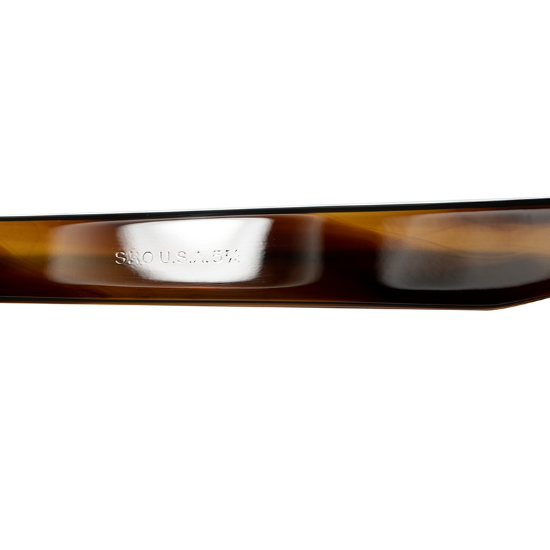

alias:: FDR

- 
  A clear grey [SRP FDR](logseq://graph/wiki?page=Styl-Rite%20Optical%20FDR) with an amber [unmarked FDR](((67f42cb0-6598-46a7-93e0-88f69fa5605e))) frames
- **FDR** is a common name for a popular American [eyewear frame]([[Frame]]) family from [[1950s]] and [[1960s]]
- It's well known for being the classic American bold and large eyewear, with prominent 3 dot rivets
	- It's very popular back then, and even brought back in films like [A Complete Unknown](https://en.wikipedia.org/wiki/A_Complete_Unknown), where it was worn by multiple characters who are depicted as those further up the food chain in [1960s America]([[1960s]])
- Modern companies like Julius Tart still manufactures and sells this frame
- # Features (all frames)
	- 7-barreled [hinges]([[Hinge]])
		- [SRO Example 1](((67f40166-14f6-41ca-a0d8-a0c32c11caad)))
		  
		- [Unmarked Example 1](((67f40714-2a17-4fd0-a09b-c9f2a08612b2))):
		  
	- 3-dot front rivets
		- [SRO Example 1](((67f40166-14f6-41ca-a0d8-a0c32c11caad)))
		  
		- [Unmarked Example 1](((67f40714-2a17-4fd0-a09b-c9f2a08612b2))):
		  
	- Spatula temples with 3-dot rivets
		- Earlier models lack [steel bars inside the temples]([[Reinforcement]])
			- [SRO Example 1](((67f40166-14f6-41ca-a0d8-a0c32c11caad)))
			  
			- [Unmarked Example 1](((67f40714-2a17-4fd0-a09b-c9f2a08612b2))):
			  
		- Later frames (i.e. from [[1960s]]) and the reproductions (e.g. [Julius Tart](https://www.juliustartoptical.com/fdr24.html)) usually come with [reinforced]([[Reinforcement]]) temples
			- Julius Tart FDR
			  
- # Unmarked FDR frames
  id:: 67f42cb0-6598-46a7-93e0-88f69fa5605e
	- We believe the FDR frames were so popular that all manufacturers rushed to produce them to capture the market share
	- This led to many "prototypes" or unrefined versions among the examples
	- Some of these lack any meaningful identification, except for the country of origin (usually USA)
	- We call these frames *unmarked*, because the markings are too ambiguous for us to determine their manufacturers
		- **Example**: this is unmarked because the marking only says USA
		  
		- **Anti-examples**: these examples are *not unmarked*! They are both marked with [[SRO]]:
		  [SRO FDR Example 1](((67f40166-14f6-41ca-a0d8-a0c32c11caad))): with cursive logo
		  
		  [SRO FDR Example 2](((67f41c8a-6a02-479c-a7fc-bb8c6e884539))): This one's typeface just looks just like the unmarked one above
		  
	- These *unmarked* frames usually lack manufacturer names or any other useful identification, and most likely will only say `USA`, `Made in USA`, or `Handmade in USA`
- # #Photographs
	- ## Example 1
	  id:: 67f40714-2a17-4fd0-a09b-c9f2a08612b2
		- Amber FDR with `USA 6` stamped on the temple, possibly from [[1950s]] because its temples are not [reinforced]([[Reinforcement]])
		- {:height 487, :width 718}
		- 
		- We can use the typeface or recognize some patterns to trace manufacturer, but that's all we got and we've not been able to discern where this example came from
		  
		- 
		- 
		- 
		- 
	- ## Comparison 1
		- An [unmarked example 1 (amber)](((67f40714-2a17-4fd0-a09b-c9f2a08612b2))) sitting side by side to [SRO FDR Example 1 (clear)](((67f40166-14f6-41ca-a0d8-a0c32c11caad)))
		- The unmarked frames are stamped `USA 6`, with 6 probably referring to the temple length in inches
		- 
		- 
		- 
		  
		  
		- 
		- 
		- 
		- 
	- [Courtesy of a Thai Facebook group: ชุมชนแว่นวินเทจ](https://www.facebook.com/groups/1761255333918207)
		- Julius Tart reproduction in honey yellow, and unmarked vintage unreinforced FDR-style frames.
			- 
			- 
		- Black and clear frames, both worn by Gary Oldman (unknown make/model)
			- 
			- 
			- 
			- 