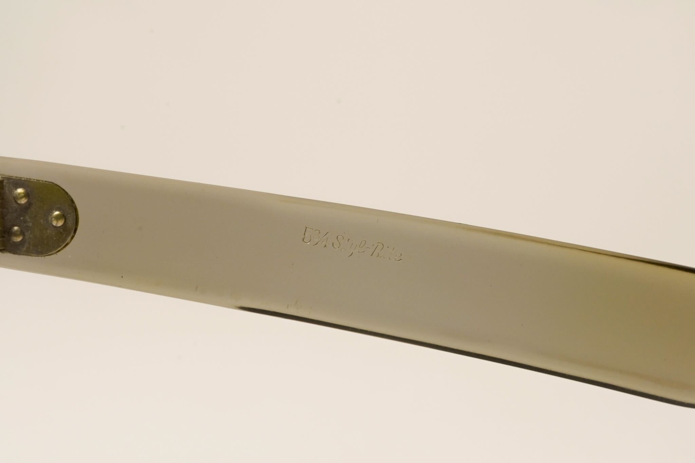

alias:: FDR

- FDR-style frames are popular American frame family from [[1950s]] and [[1960s]]
- It seems to be very popular among powerful men due to its bold looks
	- It's very popular back then, and even brought back in period films like A Complete Unknown, where it was worn by multiple characters who are depicted as those further up the food chain
- Modern companies like Julius Tart still manufactures and sells this frame
- # Unmarked FDR frames
	- ## What is unmarked?
		- We believe the FDR frames were so popular that all manufacturers rushed to produce them to capture the market share
		- This led to many "prototypes" or unrefined versions among the examples
		- Some of these lack any meaningful identification, except for the country of origin (usually USA)
		- We call these frames *unmarked*, because the markings are too ambiguous for us to determine their manufacturers
			- **Example**: this is unmarked because the marking only says USA
			  
			- **Anti-example**: this is *not unmarked*! It's marked with [[SRO logo]]([[SRO]]), so we can discern the manufacturer
			  
		- These examples usually lack manufacturer names, and most likely will only say `USA`, `Made in USA`, or `Handmade in USA`
	- ## Example 1 #Photographs
		- Amber `USA 6`, possibly from [[1950s]] because its temples are not [reinforced]([[Reinforcement]])
		- 
		- 
		- 
		- 
		- 
		- 
		- 
- # Features (in all frames)
	- 7-barreled [hinges]([[Hinge]])
		- From SRO
		  
		- Unmarked example:
		  
	- 3-dot front rivets
		- [[SRO FDR]]
		  
		- From unmarked
		  
	- Spatula temples with 3-dot rivets
		- Earlier models lack [steel bars inside the temples]([[Reinforcement]])
			- [[SRO FDR]]
			  
			- Unmarked, amber
			  
		- Later frames (i.e. from [[1960s]]) and the reproductions (e.g. [Julius Tart](https://www.juliustartoptical.com/fdr24.html)) usually come with [reinforced]([[Reinforcement]]) temples
			- Julius Tart FDR
			  
- # #Photographs
	- [[SRO FDR]] [Example 1](((67f40166-14f6-41ca-a0d8-a0c32c11caad))) and an unmarked frame sitting side by side
		- The unmarked frames are stamped `USA 6`, with 6 probably referring to the temple length in inches
		- 
	- [Courtesy of a Thai Facebook group: ชุมชนแว่นวินเทจ](https://www.facebook.com/groups/1761255333918207)
		- Julius Tart reproduction in honey yellow, and unmarked vintage unreinforced FDR-style frames.
			- 
			- 
		- Black and clear frames, both worn by Gary Oldman (unknown make/model)
			- 
			- 
			- 
			- 