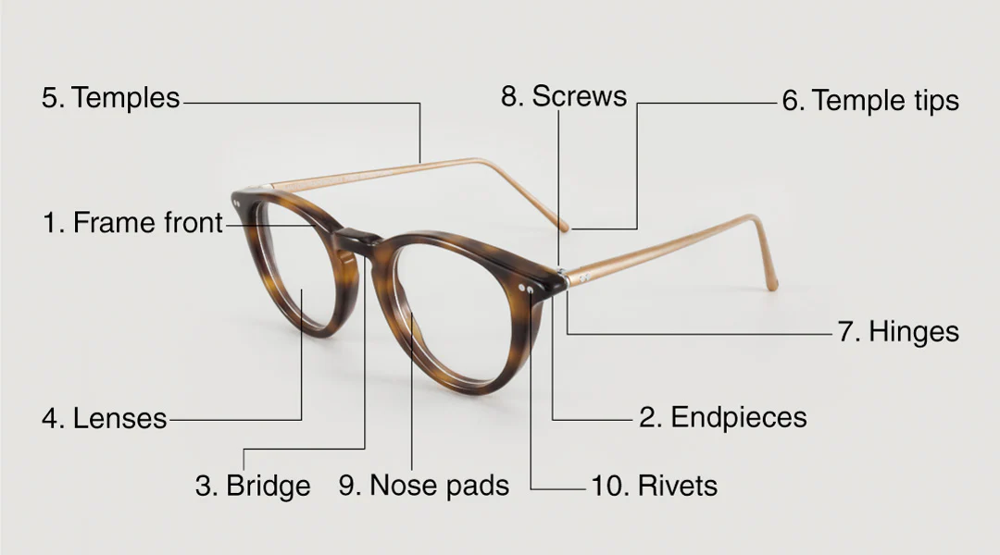

alias:: Frame

- Frames are the main structure of a modern eyewear
- It provides mount points for other parts, like the lenses, hinges, and other things
- ## Parts
	- 
	- Eyewear frames is composed of multiple parts
	- So we're not going to list out all of these parts
	- Chassis
		- The chassis includes the whole centerpiece of the eyewear, and it includes
			- Eye wire
				- Lens will be fixed here
			- [[Bridge]]
				- Connects both eye wires together
			- Frame front
				- The rest of the chassis
			- [[Endpiece]]
				- The outermost part of the chassis, usually protruding out to provide space for fastening of the hinge
				- This is where the [front rivets]([[Rivet]]) are secured
	- [[Temple]]
	  id:: 67fc19f8-92ea-4e11-8dec-ddfefb3589f4
	- [[Hinge]]
	- [[Lens]]
	- [[Nose pad]]
		- [[Nose arm]]
	- [[Rivet]]
		- [[Temple rivet]]
		- [[Hinge rivet]]
- ## Materials
	- Pre-WW2 frames had historically been built using metal or organic materials. Silver, steel, gold-plated steel, tortoise shell, and animal horns were common
	- During WW2, the American War efforts propped up many plastics factories to help build plastic parts to replace the use of metals in non-critical components and parts. Eyewear frames are also one of those use cases.
		- > The plastics in use at the times were both organic and inorganic
		- This made the Western population more familiar with plastics
	- > Note that some frames might contain different materials in one frame, like acetate on steel
	- [[Steel]]
		- Steel is strong and relatively cheap, so it is usually used in parts of eyewear like [[Hinge]] and [[Reinforcement]]
	- [[Silver]]
		- Because glasses and spectacles were considered very luxury for most populations, the eyewear back then was made by jewelers, who favored silver.
		- Antique and vintage European frames tend to be made from silver
	- [[Gold]]
		- Another popular material for luxury eyewear
	- [[Horn]]
		- Horn is lighter than metal, so most large and thick frames back in the day tends to be made out of horn
		- Because horn is organic and relatively unprocessed, each piece will look different
	- [[Cellulose acetate]]
		- First synthesized in 1865, Cellulose acetate is a synthetic organic plastic made from plant materials, which has found uses in:
			- Photographic films
			- Cigarette filters
			- Eyewear frames
		- The French supposedly started making frames out of acetate first, likely due to post-war rations on metals, the Americans then followed suite