alias:: SRO 820
#[[Styl-Rite Optical]] #Frame

- 
- SRO 820 is an [ophthalmic]([[Ophthalmic]]) [acetate eyewear frame]([[Acetate]]), estimated to be have been produced from late #1950s to #1960s
- We have plenty of photographs on the 820, because it's been [Woody Allen's signature eyewear](https://en.wikipedia.org/wiki/Woody_Allen) since the #1960s
	- 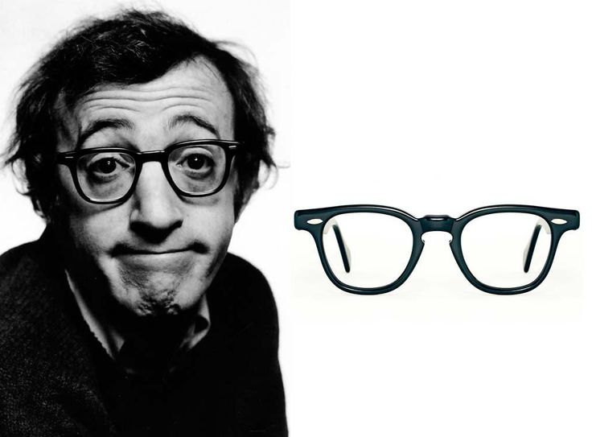
- We've only seen it in black, so far
- It seems SRO 820 is the original inspiration for TVR 523:
	- 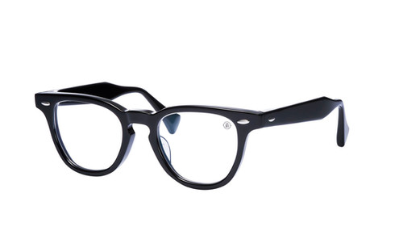
- # Features
	- [[Keyhole bridge]]
		- 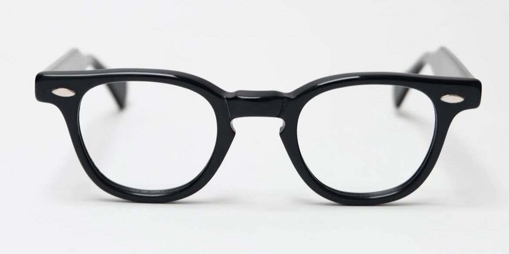
		- 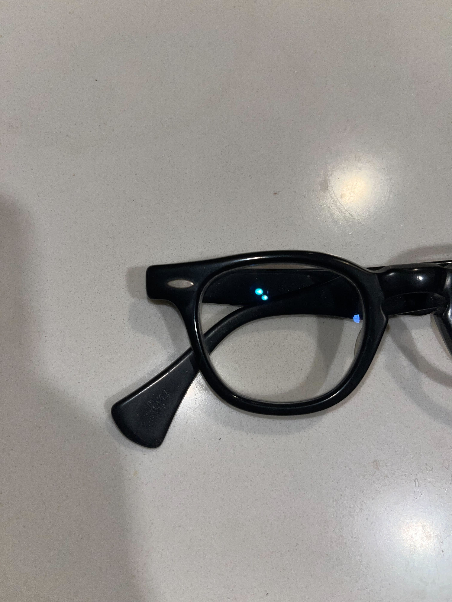
	- 7-barreled [hinges]([[Hinge]])
		- 
		- 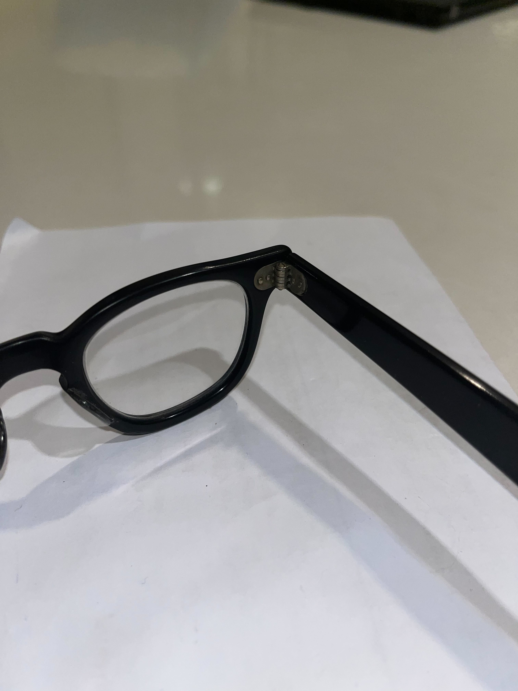
	- [Rice rivets]([[Rice rivets]])
		- 
		- 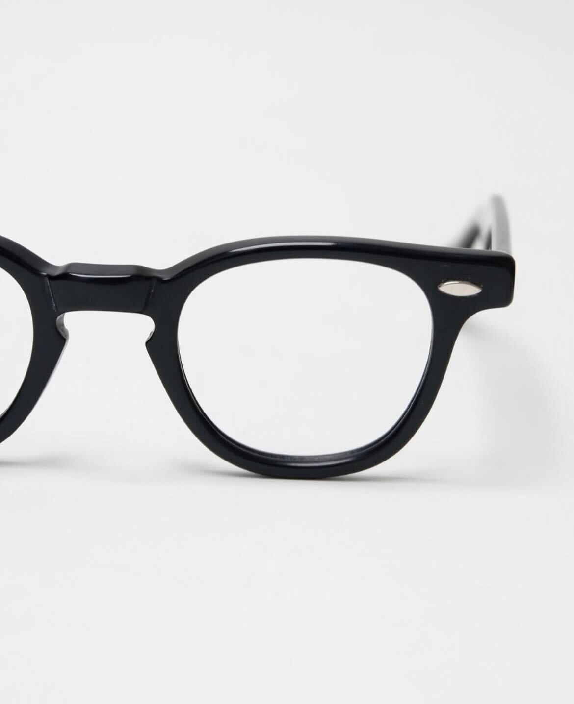
	- Thick [[Spatula temples]]
		- 
		- 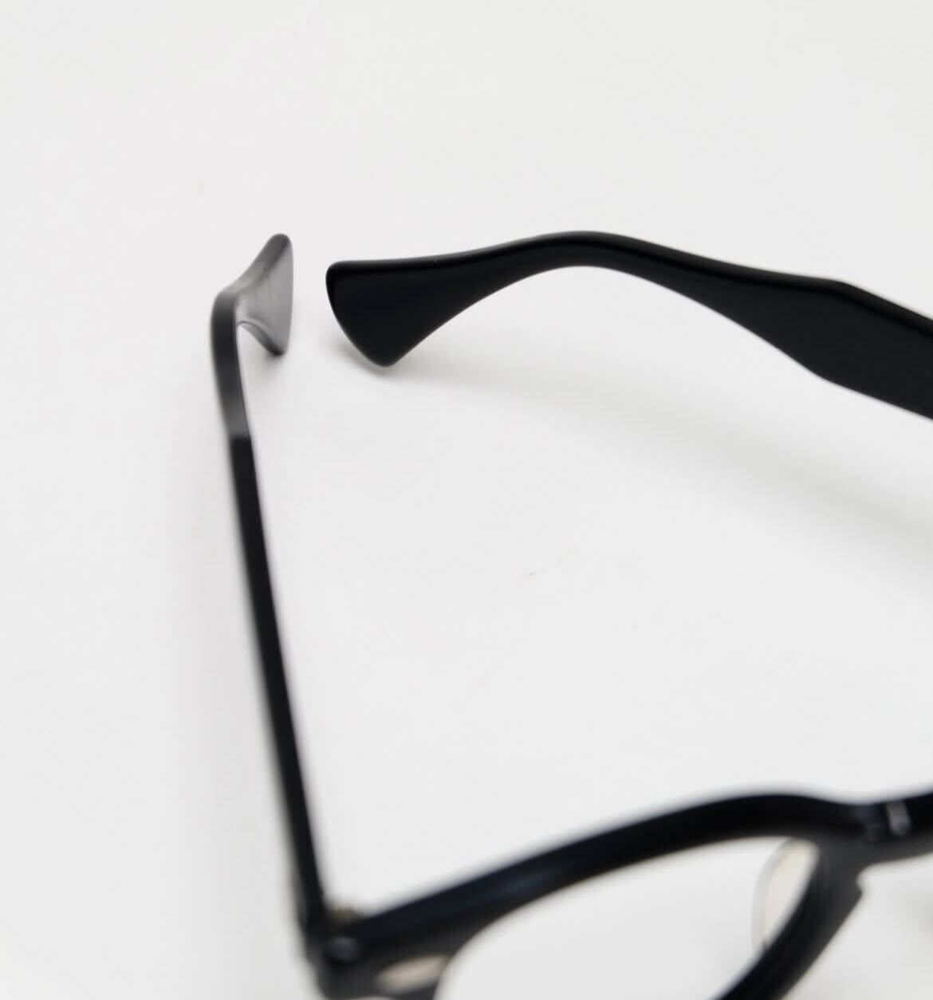
- # #Photographs
	- ## Example 1
		- Black SRO 820 44-24-140 #1950s
		- 
		- 
		- 
		- 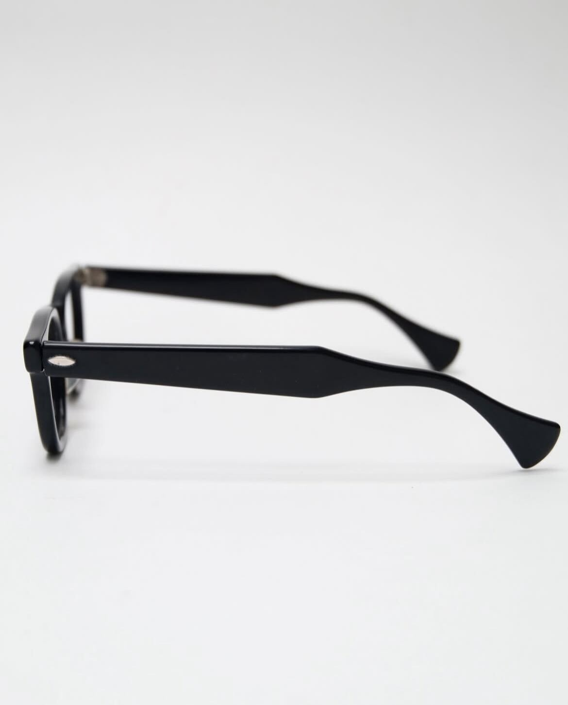
		- 
		- 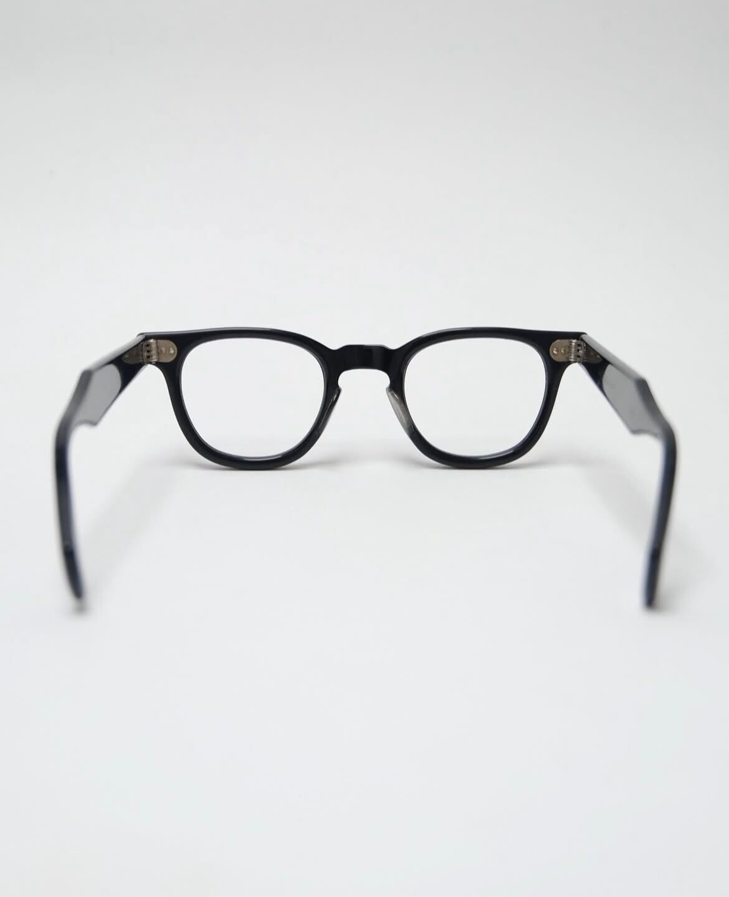
		- 
		- 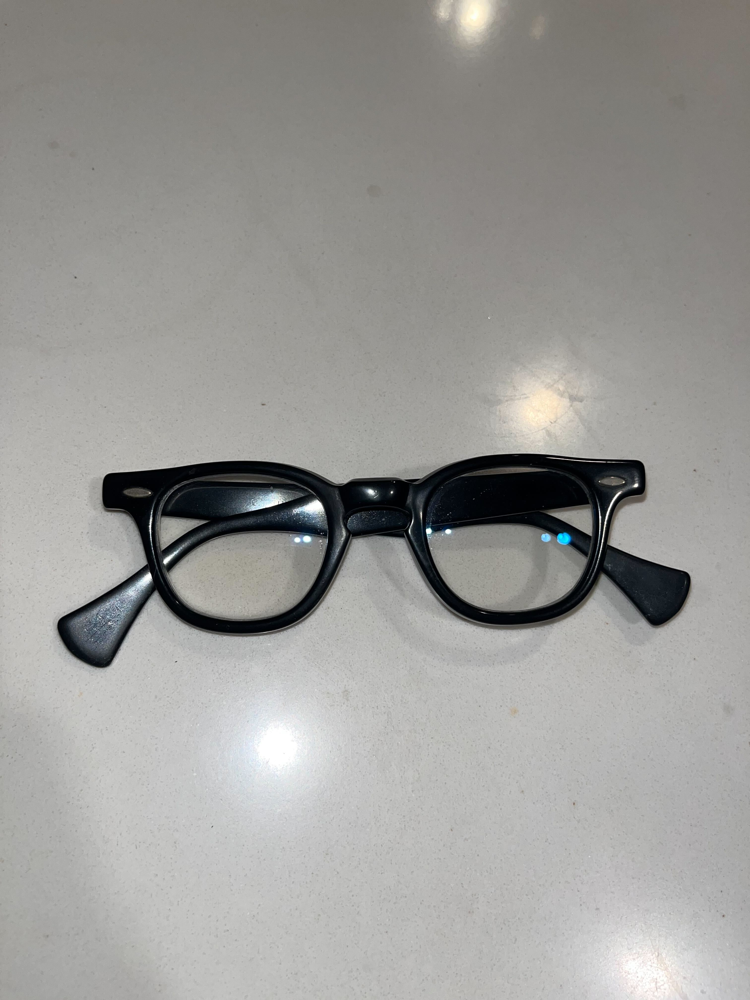
	- ## Example 2
		- > With original paper packaging
		- Back SRO 820 42-20 Listing from http://ponmegane.cocolog-nifty.com/pon/2014/01/vintage-sro-2a2.html
		- 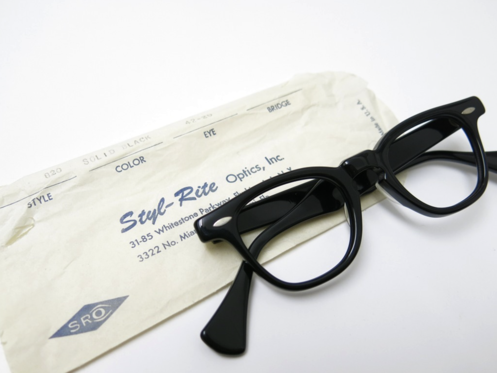
		- 
		- 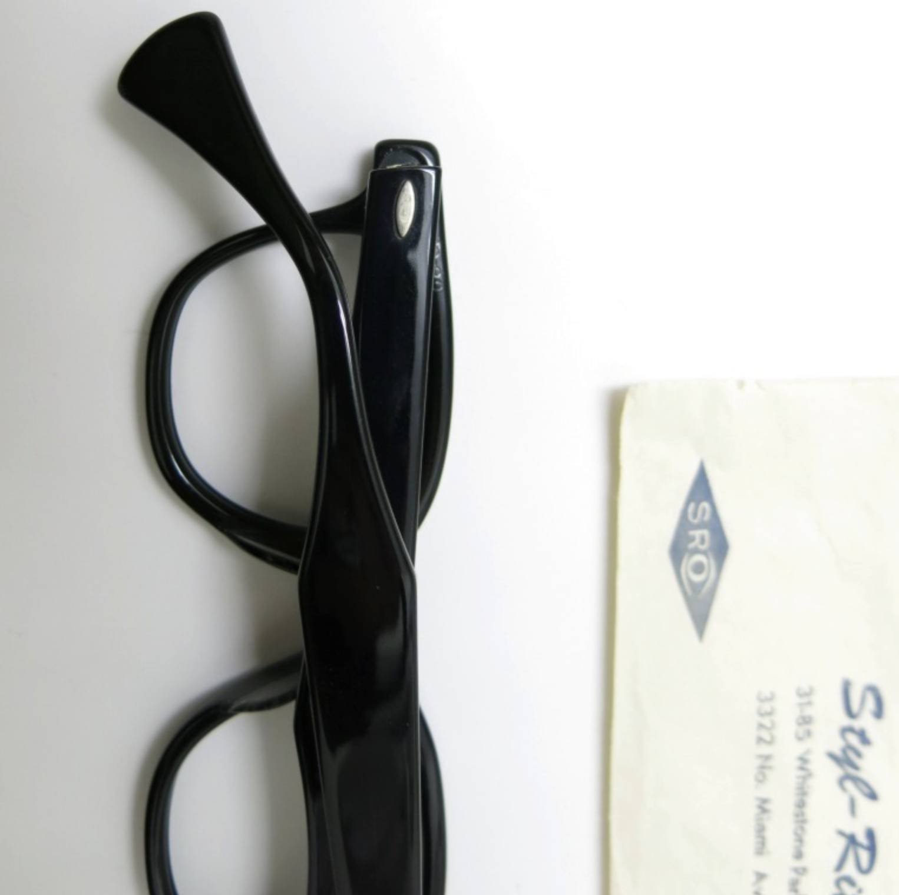
		- 