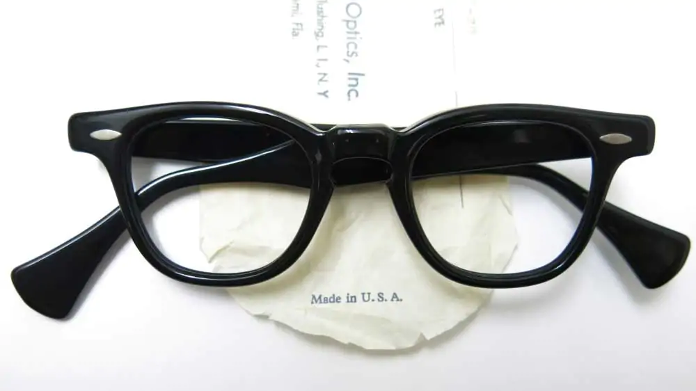

alias:: SRO 820
#[[Styl-Rite Optical]] #Frame

- 
- SRO 820 is an [ophthalmic]([[Ophthalmic]]) [acetate eyewear frame]([[Acetate]]), estimated to be have been produced from late #1950s to #1960s
- We have plenty of photographs on the 820, because it's been [Woody Allen's signature eyewear](https://en.wikipedia.org/wiki/Woody_Allen) since the #1960s
- We've only seen it in black, so far
- It seems SRO 820 is the original inspiration for TVR 523
	- 
- # Features
	- 7-barreled [hinges]([[Hinge]])
	- Keyhole style
	- Grain rivets
- # #Photographs