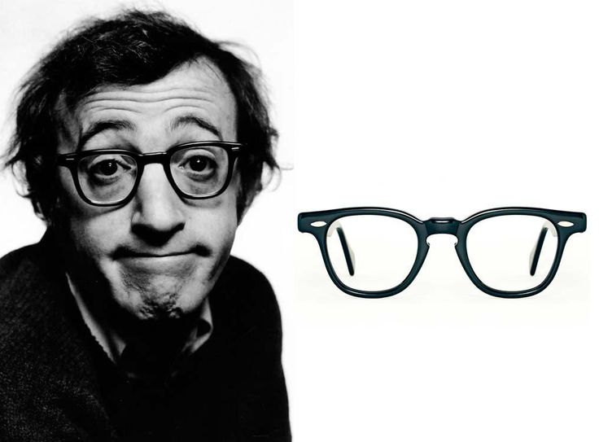
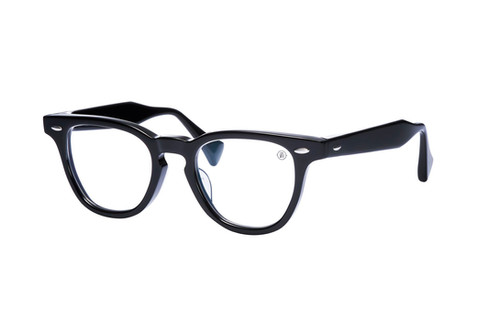
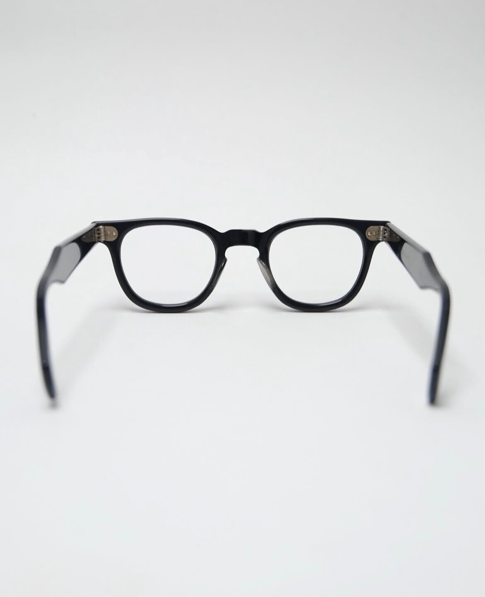
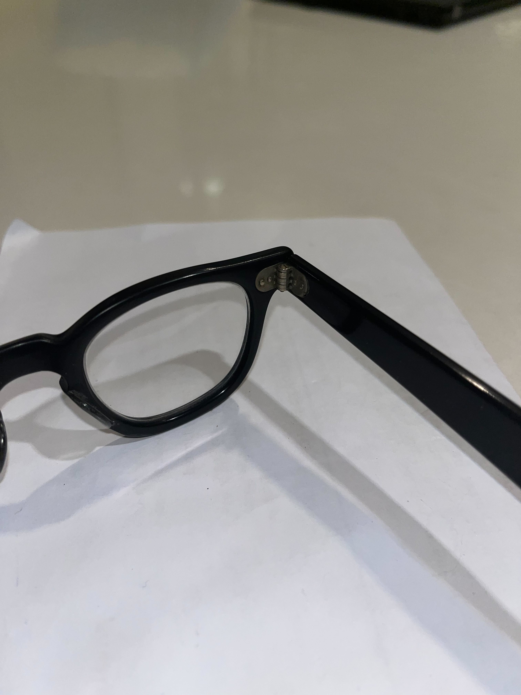
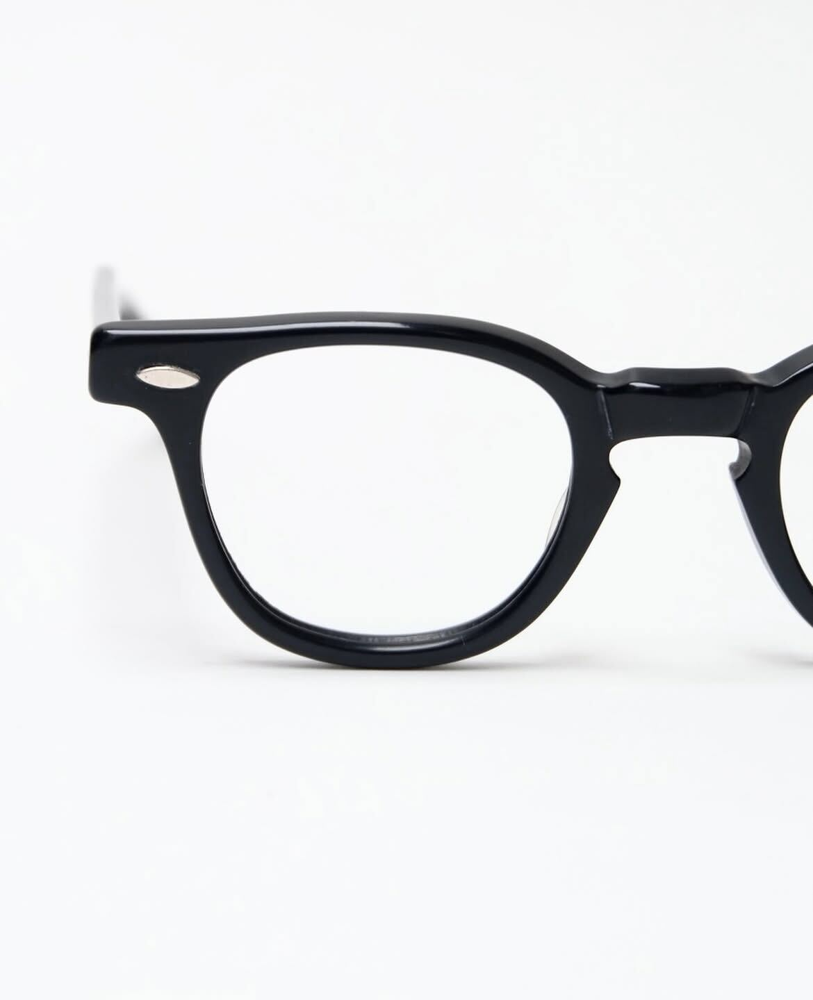
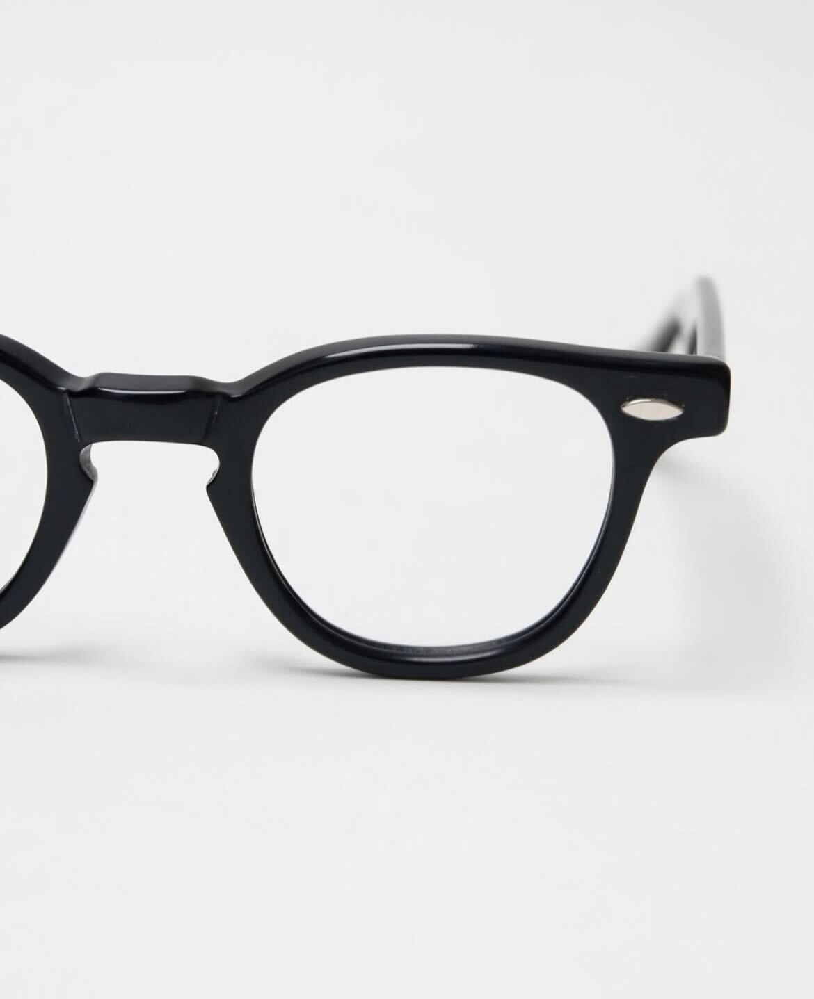
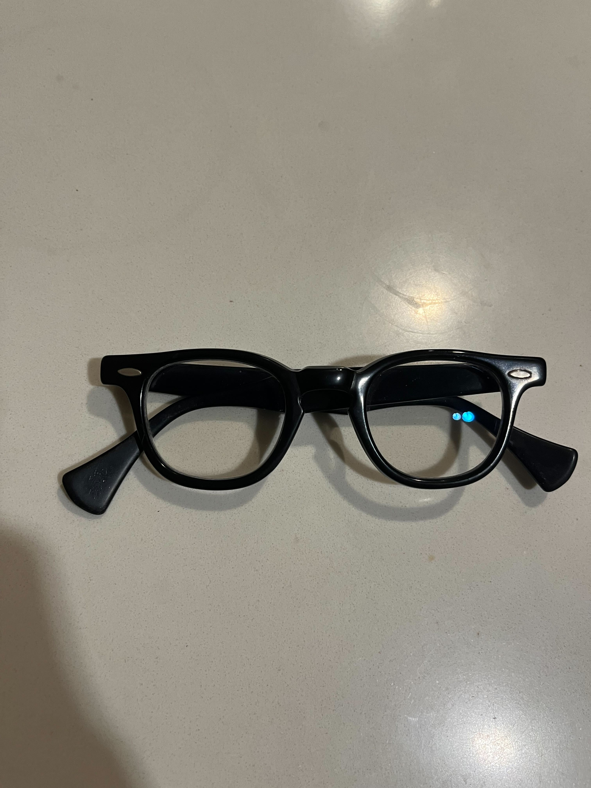
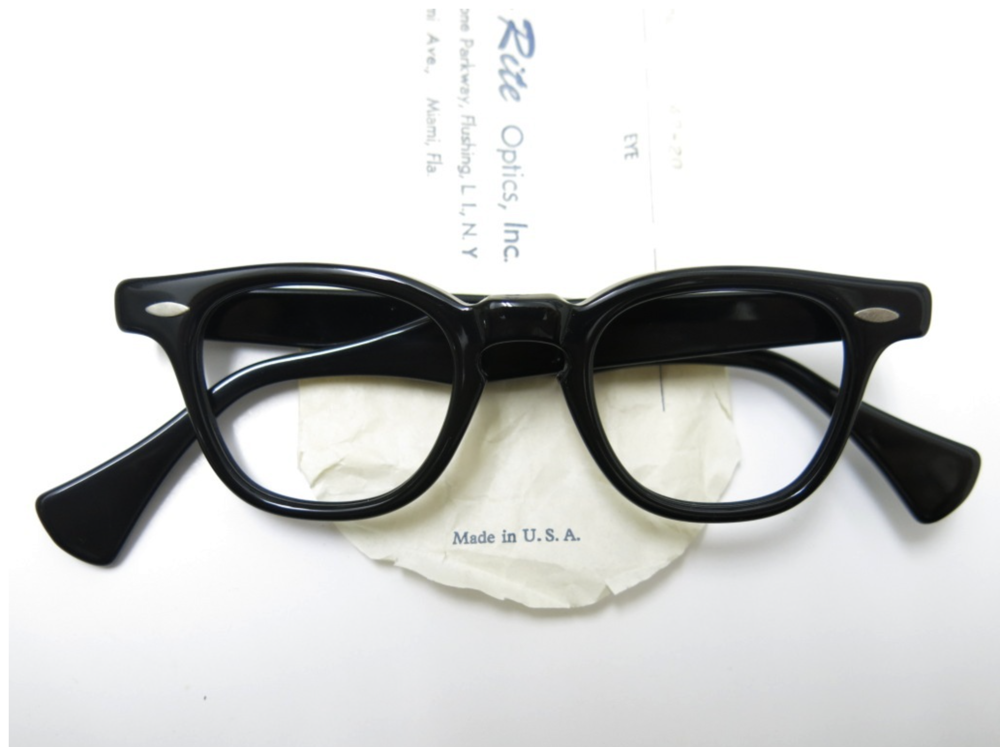
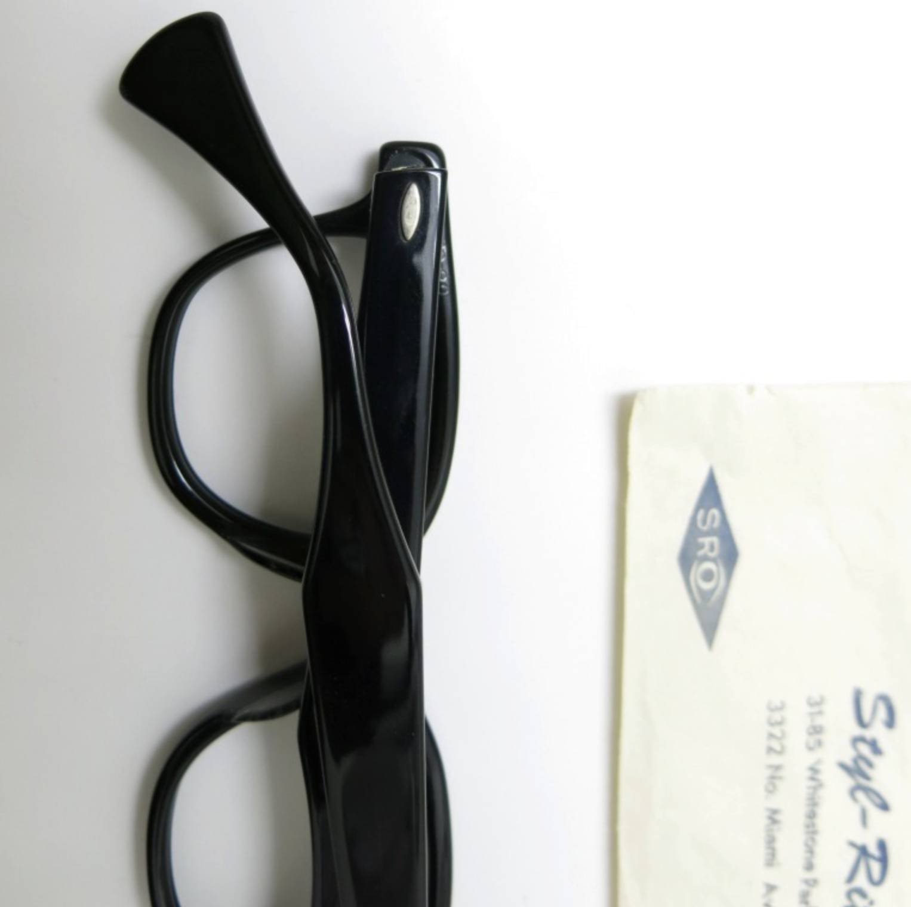
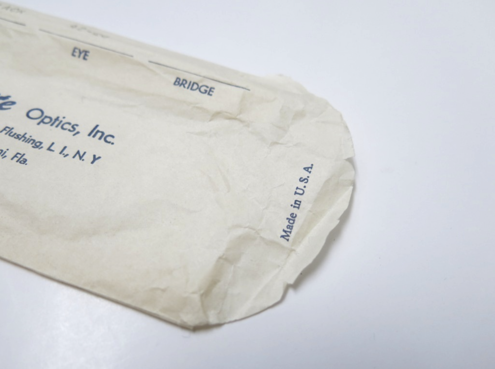

tags:: FrameModel
alias:: SRO 820
frame-manufacturer:: [[Styl-Rite Optical]] 
frame-origin:: [[US]] 
frame-era:: [[1950s]] [[1960s]] 
frame-material:: [[Acetate]] 
frame-bridge:: [[keyhole]] 
frame-hinge:: [[7-barreled]] 
frame-temple:: [[Spatula temples]] [[Convertible temple]]
frame-rivet:: [[Rice rivet]] 
frame-endpiece::

- 
- SRO 820 is an [ophthalmic]([[Ophthalmic]]) [acetate eyewear frame]([[Acetate]]), estimated to be have been produced from late #1950s to #1960s
- We have plenty of photographs on the 820, because it's been [Woody Allen's signature eyewear](https://en.wikipedia.org/wiki/Woody_Allen) since the #1960s
	- 
- We've only seen it in black, so far
- It seems SRO 820 is the original inspiration for TVR 523:
	- 
- # Features
  tags:: Features
	- ## [[Bridge]]
	  frame-bridge:: [[keyhole]]
		- 
		- 
	- ## [[Hinge]]
	  frame-hinge:: [[7-barreled]]
		- 
		- 
	- ## [[Temple]]
	  frame-temple:: [[Spatula temples]], [[Convertible temple]]
		- 
		- 
	- ## [[Rivet]]
	  frame-rivet:: [[Rice rivet]]
		- 
	- ## [[Identification]] 
	  frame-iden::
- # #Photographs
	- ## Example 1
		- Black SRO 820 44-24-140 #1950s
		- 
		- 
		- 
		- 
		- 
		- 
		- 
		- 
	- ## Example 2
		- > With original paper packaging
		- Back SRO 820 42-20 Listing from http://ponmegane.cocolog-nifty.com/pon/2014/01/vintage-sro-2a2.html
		- 
		- 
		- 
		- 