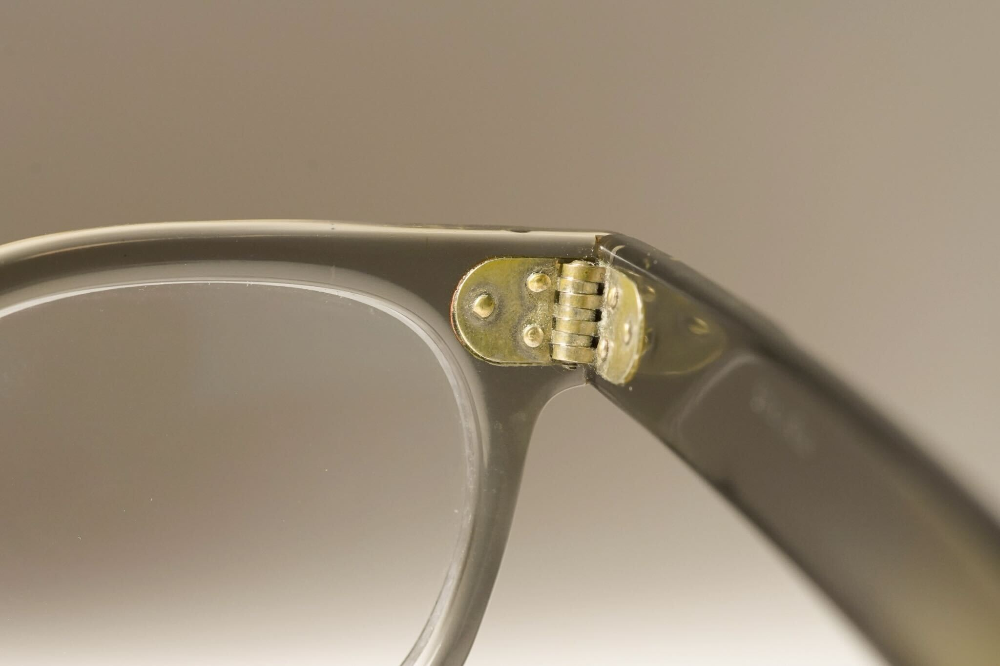
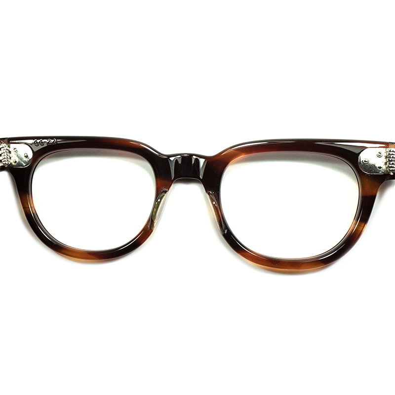
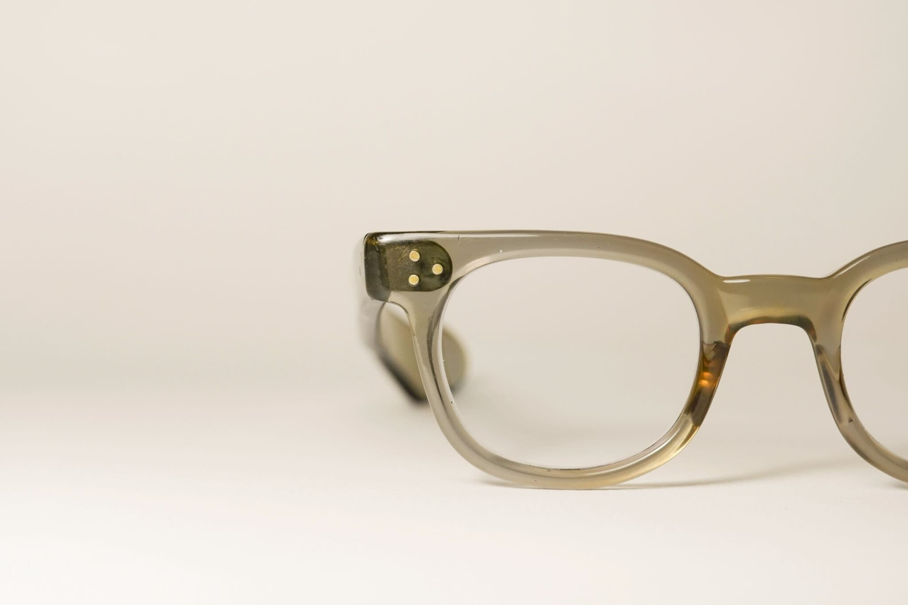
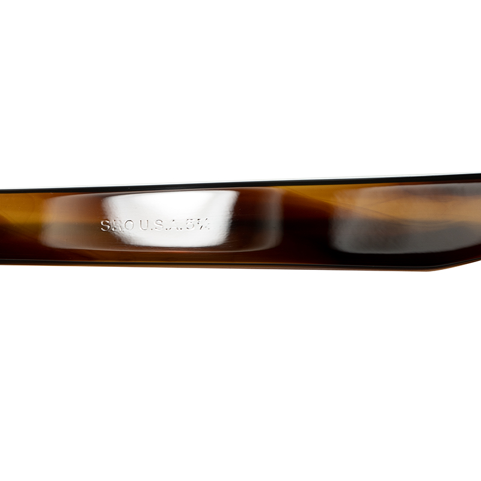
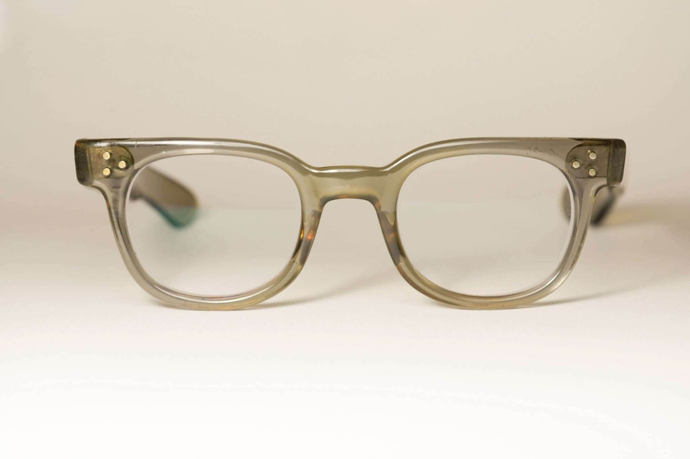
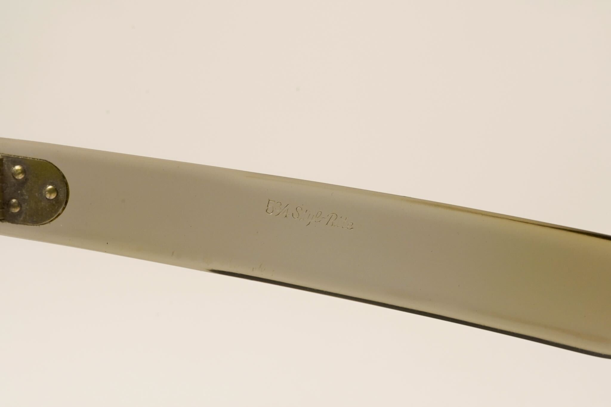
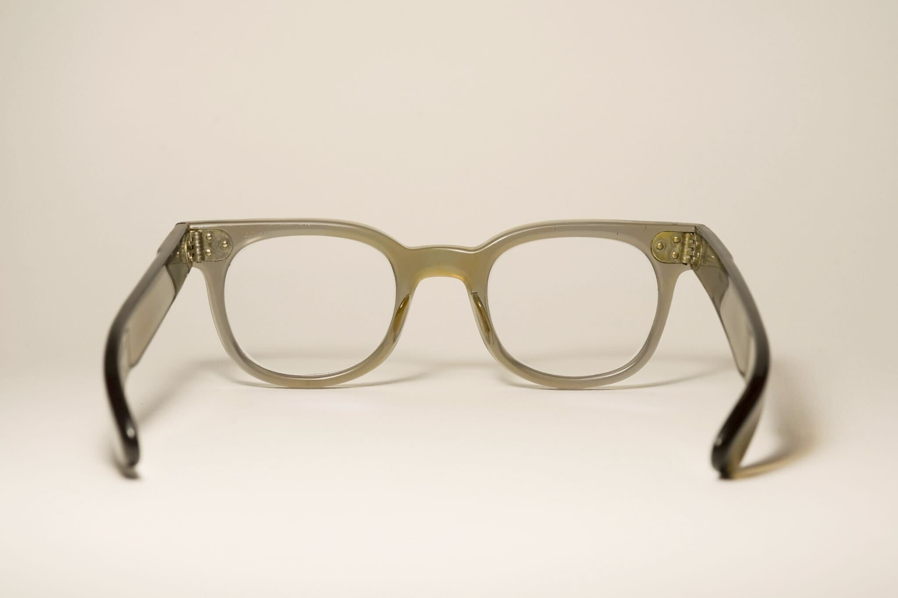
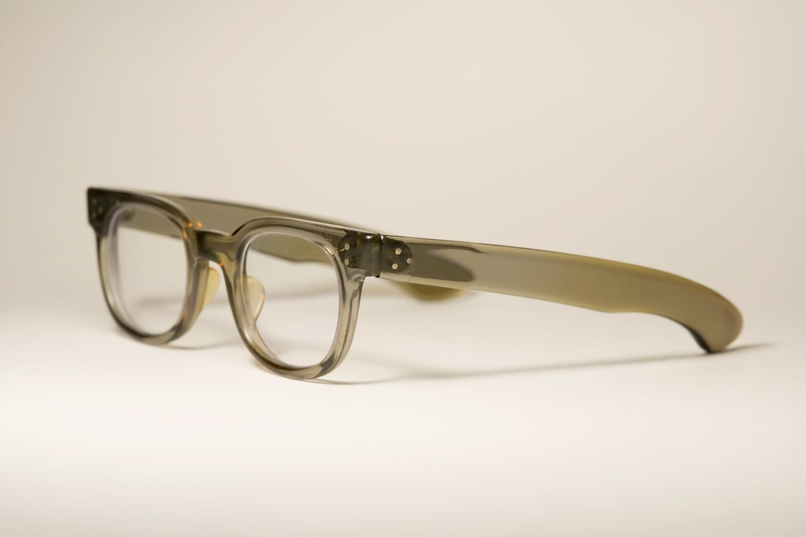
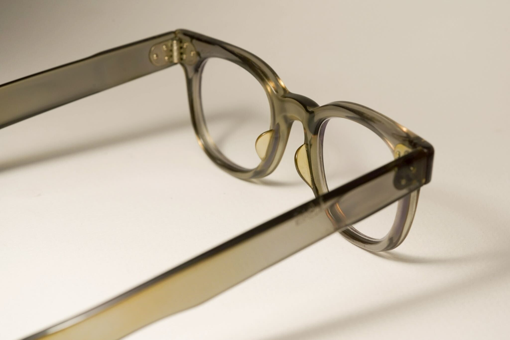

alias:: SRO FDR
#[[Styl-Rite Optical]] #Frame

- 
- SRO, like other American manufacturers of the time, also produced [[FDR]] frames
- > Note: We only have come across a total of 1 example of FDR frames from SRO. [Its temples are not reinforced]([[Reinforcement]]), suggesting it's from [[1950s]]
- # Features
	- 7-barreled [hinges]([[Hinge]])
		- [Example 1](((67f40166-14f6-41ca-a0d8-a0c32c11caad)))
		  
		  
		- From [Gig-lamps](https://www.gig-lamps.com/home/1950s-styl-rite-optics-fdr-amber-made-in-usa-size-44-22-%E3%82%A2%E3%83%A1%E3%83%AA%E3%82%AB%E8%A3%BD-sro-%E8%8A%AF%E3%81%AA%E3%81%97%E3%83%86%E3%83%B3%E3%83%97%E3%83%AB-fdr/)
		  
	- Triple front rivets
		- 
	- Triple temple rivets on [unreinforced]([[Reinforcement]]) spatula temple
		- 
		- 
	- Identification markings
		- [Example 1](((67f40166-14f6-41ca-a0d8-a0c32c11caad)))
		  
		- [Example 2](((67f41c8a-6a02-479c-a7fc-bb8c6e884539))):
		  id:: 67f41d3e-d5be-4fcb-8a6e-18c45d91ddd4
		  {:height 726, :width 718}
- # #Photographs
	- ## Example 1
	  id:: 67f40166-14f6-41ca-a0d8-a0c32c11caad
		- A clear, grey SRO FDR with size 44-24 from [[1950s]]
		- Note the yellowish hue in the acetate due to [acetate degradation]([[Acetate]])
		- 
		- SRO-stamped temple
		  
		- 
		- 
		- 
		- 
		- 
	- ## [Example 2 (courtesy of gig-lamps)](https://www.gig-lamps.com/home/1950s-styl-rite-optics-fdr-amber-made-in-usa-size-44-22-%E3%82%A2%E3%83%A1%E3%83%AA%E3%82%AB%E8%A3%BD-sro-%E8%8A%AF%E3%81%AA%E3%81%97%E3%83%86%E3%83%B3%E3%83%97%E3%83%AB-fdr/)
	  id:: 67f41c8a-6a02-479c-a7fc-bb8c6e884539
		- Amber SRO FDR, 44-22, [[1950s]]
		- https://www.gig-lamps.com/home/images/gl-a9170-1.jpg
		- SRO marking
		  id:: 67f41d09-50fe-48c4-a916-aa8b57386dcf
		  https://www.gig-lamps.com/home/images/gl-a9170-6.jpg
		- https://www.gig-lamps.com/home/images/gl-a9170-2.jpg
		- https://www.gig-lamps.com/home/images/gl-a9170-3.jpg
		- https://www.gig-lamps.com/home/images/gl-a9170-4.jpg
		- https://www.gig-lamps.com/home/images/gl-a9170-5.jpg