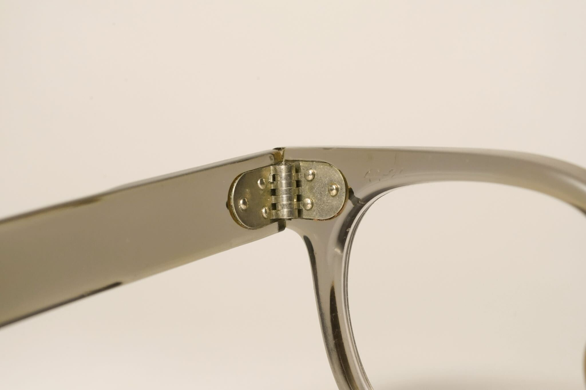
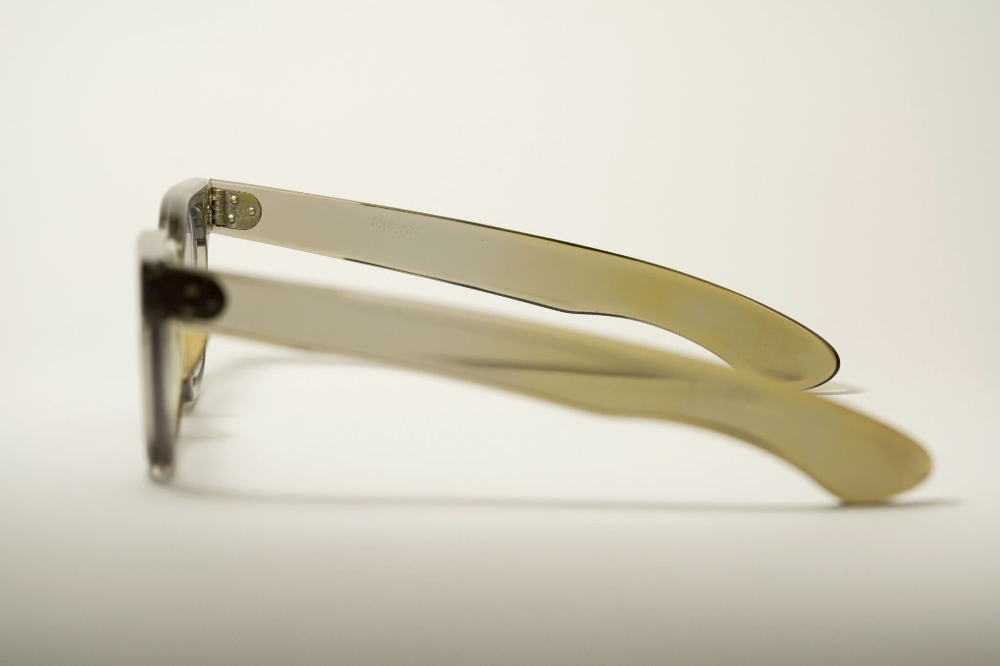
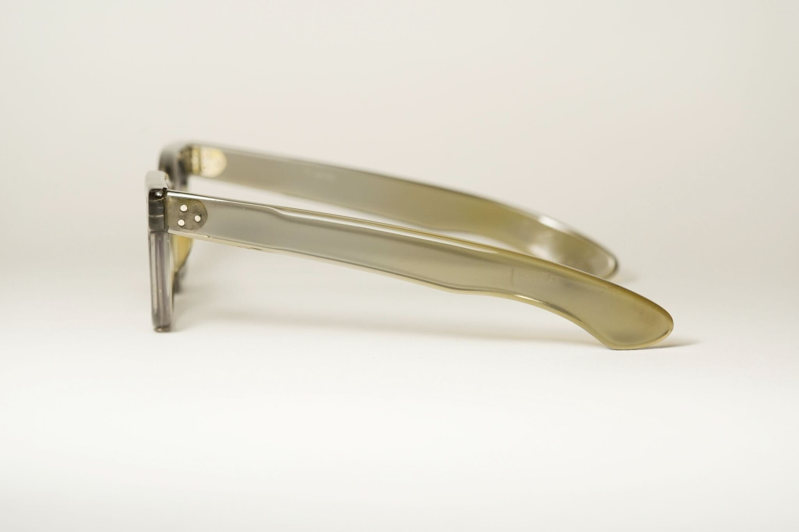
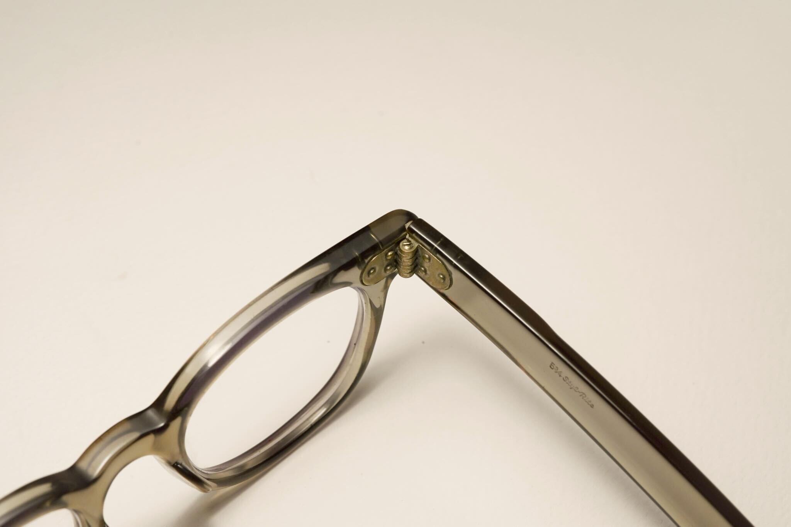

tags:: FrameModel, FDR
alias:: SRO FDR
frame-manufacturer:: [[SRO]] 
frame-origin:: [[American]] 
frame-era:: [[1950s]] [[1960s]] 
frame-material:: [[Acetate]]
frame-bridge:: [[Keyhole bridge]]
frame-temple:: [[Spatula temples]] [[Skull temple]] 
frame-hinge:: [[Standard bridge]] 
frame-rivet:: [[Dot rivets]] 
frame-endpiece::

- 
  id:: 68127b0a-0515-4964-b032-91dd8ac1e500
- SRO, like other American manufacturers of the time, also produced [[FDR]] frames
- > Note: We only have come across a total of 1 example of FDR frames from SRO. [Its temples are not reinforced]([[Reinforcement]]), suggesting it's from #1950s
- # Features
  tags:: Features
	- ## [[Bridge]]
	  frame-bridge:: [[Standard bridge]]
		- {{embed ((68127b0a-0515-4964-b032-91dd8ac1e500))}}
	- ## [[Hinge]]
	  frame-hinge:: [[7-barreled]]
		- [Example 1](((67f40166-14f6-41ca-a0d8-a0c32c11caad)))
		  
		  
		- From [Gig-lamps](https://www.gig-lamps.com/home/1950s-styl-rite-optics-fdr-amber-made-in-usa-size-44-22-%E3%82%A2%E3%83%A1%E3%83%AA%E3%82%AB%E8%A3%BD-sro-%E8%8A%AF%E3%81%AA%E3%81%97%E3%83%86%E3%83%B3%E3%83%97%E3%83%AB-fdr/)
		  
	- ## [[Temple]]
	  frame-temple::
		- 
		- 
	- ## [[Rivet]]
	  frame-rivet:: [[Dot rivets]]
		- 
	- ## [[Identification]]
		- [Example 1](((67f40166-14f6-41ca-a0d8-a0c32c11caad)))
		  
		- [Example 2](((67f41c8a-6a02-479c-a7fc-bb8c6e884539))):
		  id:: 67f41d3e-d5be-4fcb-8a6e-18c45d91ddd4
		  {:height 726, :width 718}
- # #Photographs
	- ## Example 1
	  id:: 67f40166-14f6-41ca-a0d8-a0c32c11caad
		- A clear, grey SRO FDR with size 44-24 #1950s
		- Note the yellowish hue in the acetate due to [acetate degradation]([[Acetate]])
		- 
		- SRO-stamped temple
		  
		- 
		- 
		- 
		- 
		- 
		- 
	- ## [Example 2 (courtesy of gig-lamps)](https://www.gig-lamps.com/home/1950s-styl-rite-optics-fdr-amber-made-in-usa-size-44-22-%E3%82%A2%E3%83%A1%E3%83%AA%E3%82%AB%E8%A3%BD-sro-%E8%8A%AF%E3%81%AA%E3%81%97%E3%83%86%E3%83%B3%E3%83%97%E3%83%AB-fdr/)
	  id:: 67f41c8a-6a02-479c-a7fc-bb8c6e884539
		- Amber SRO FDR, 44-22 #1950s
		- https://www.gig-lamps.com/home/images/gl-a9170-1.jpg
		- SRO marking
		  id:: 67f41d09-50fe-48c4-a916-aa8b57386dcf
		  https://www.gig-lamps.com/home/images/gl-a9170-6.jpg
		- https://www.gig-lamps.com/home/images/gl-a9170-2.jpg
		- https://www.gig-lamps.com/home/images/gl-a9170-3.jpg
		- https://www.gig-lamps.com/home/images/gl-a9170-4.jpg
		- https://www.gig-lamps.com/home/images/gl-a9170-5.jpg