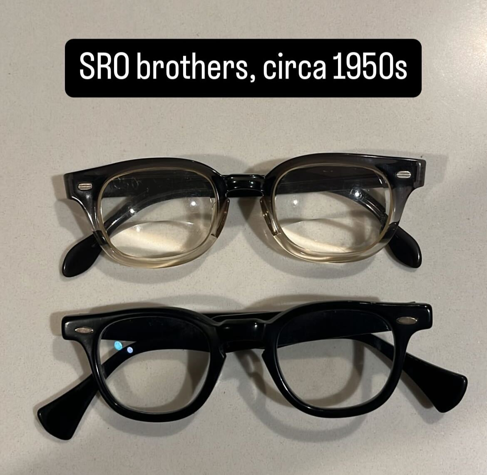
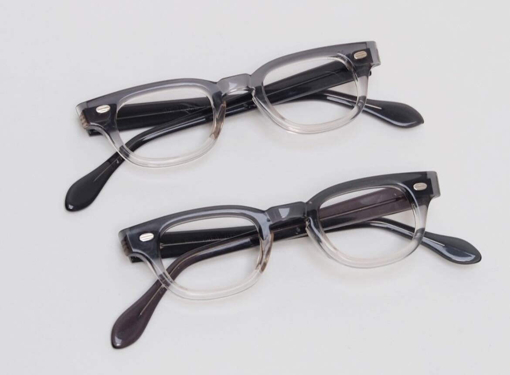
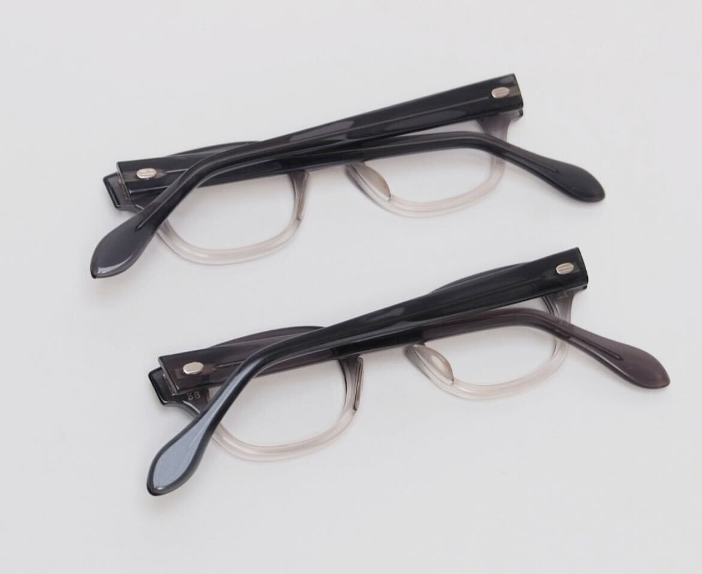

alias:: SRO unknown children's
#[[Styl-Rite Optical]]

- I bought an [[Acetate]] SRO frame off eBay, but the model was unknown
- After a while, w've come across a few examples of this type, so we think it's quite worth it to document something like this coming from SRO
- # Features
	- 7-barreled hinges
	- [Reinforced temples]([[Reinforcement]])
- # Photographs
	- Example 1
		- I found this example on eBay and bought it for around $90
		- It came with lens size 44mm
		- With [[Styl-Rite Optical 820]] (820 is the black frame at the bottom)
		  
		- Fit pic
		  
		-
	- Examples from [@after1900s on Instagram](https://www.instagram.com/after1900s/)
		- I found these examples on sale on Instagram, and they come in children's sizes, which is why I assume this model to be for children
		- 
		- 