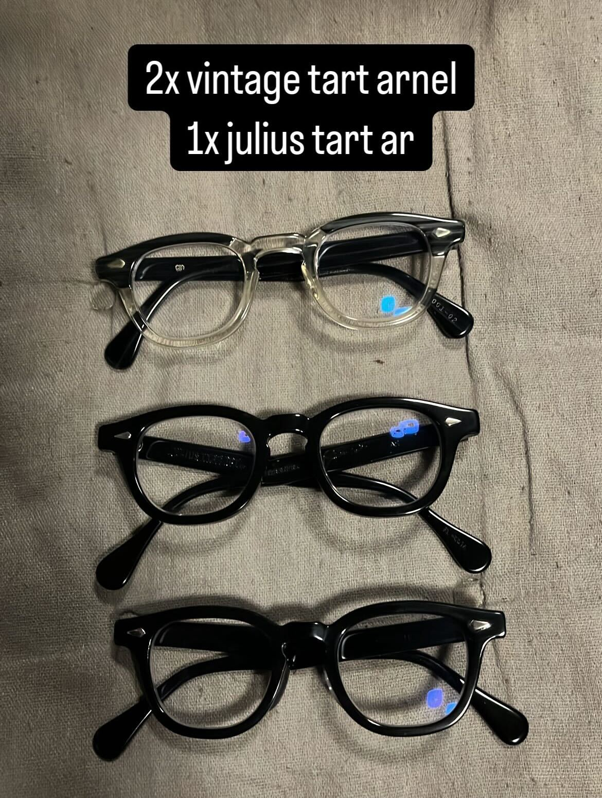
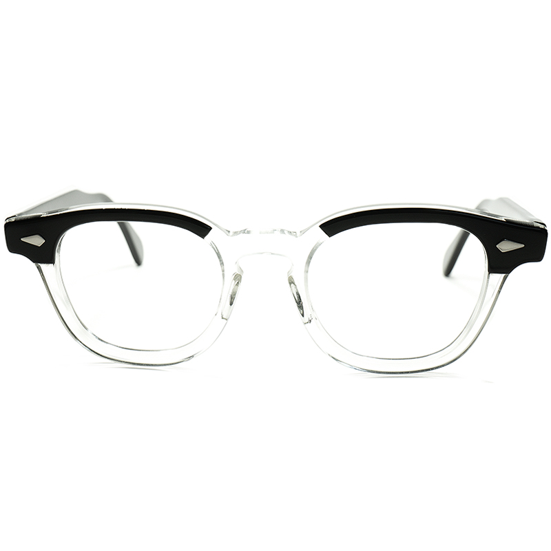
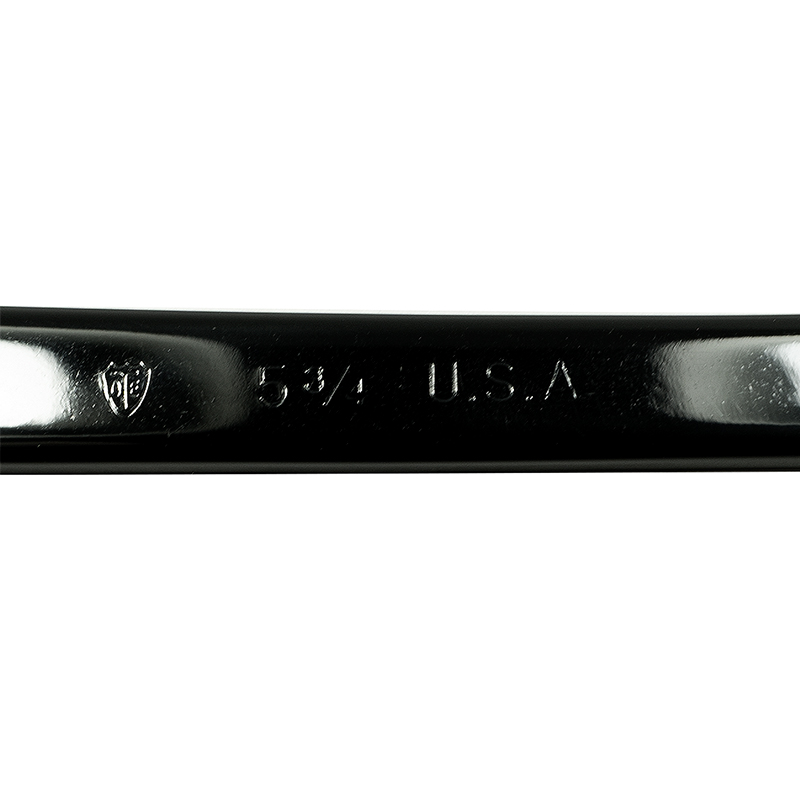
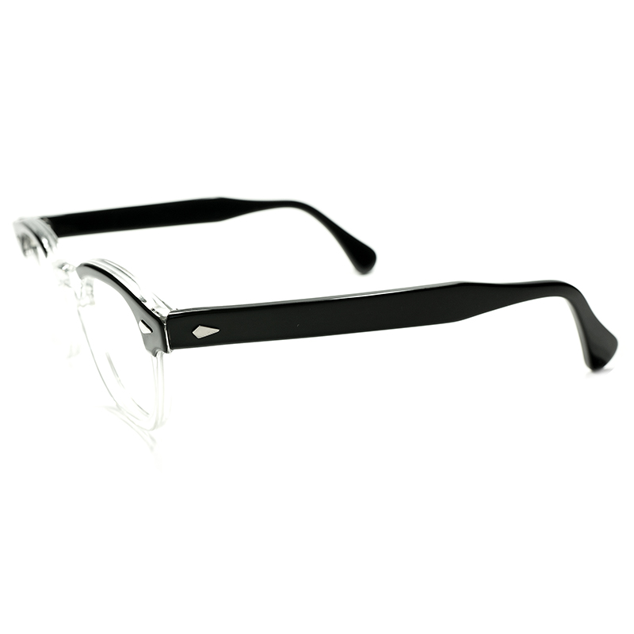
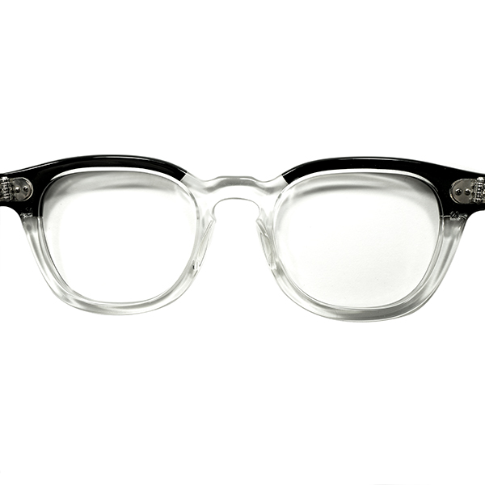

tags:: FrameModel
alias:: TOE Arnel, Arnel
frame-manufacturer:: [[Tart Optical]] 
frame-origin:: [[American]] 
frame-era:: [[1950s]] [[1960s]] [[1970s]] [[1980s]] 
frame-material:: [[Acetate]]
frame-bridge:: [[Keyhole bridge]] 
frame-endpiece::
frame-hinge:: [[7-barreled]] 
frame-rivet::

- Tart Arnel is an [acetate]([[Acetate]]) [ophthalmic]([[Ophthalmic]]) frame best known for being staple of any vintage eyewear collections
- Arnels sold for a very long time, allegedly from early #1950s up until #1980s, so there're many variations
- Most variants can be distinguished by the references, stamping, and details on the temples
- [[Arnel-style]] frames refer to copycats of the original TOE Arnel, mostly from modern companies like Moscot and other "vintage-inspired" brands
- # Features
	- 7-barreled [hinges]([[Hinge]])
	- In older examples, the temples are stamped with make and size, while newer examples feature printed text
	- In newer examples, e.g. from #1970s or #1980s, Arnels might feature ornately finished reinforcement steel bar in the temples
- # Photographs
	- 2x Vintage Arnels (blackwood and black, i.e. top and bottom), vs 1x Julius Tart reproduction (middle)
		- 
	- [Courtesy of Gig-Lamps](https://www.gig-lamps.com/home/1950s-1960s-tart-optical-arnel-2tone-blackxclear-size44-20/):
	  > 1950s-60s two-tone black/clear with stamped temples
		- 
		- 
		- 
		- 