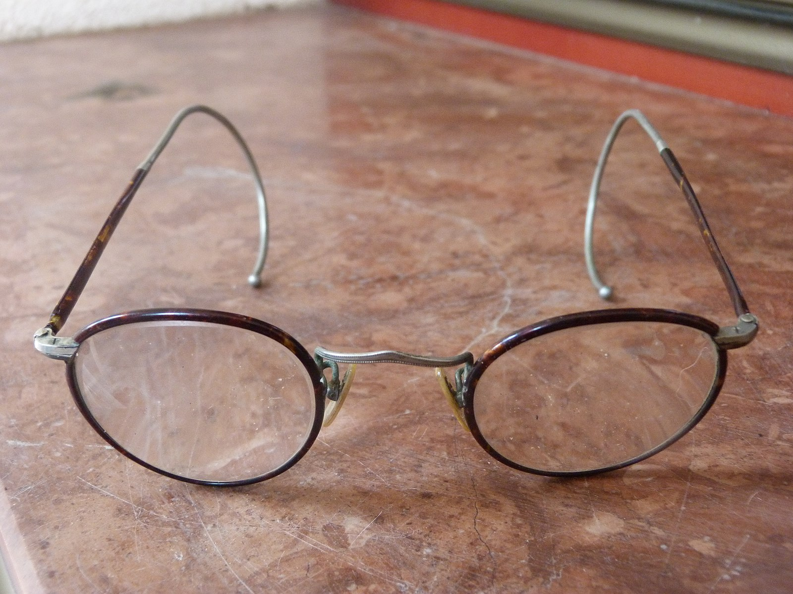
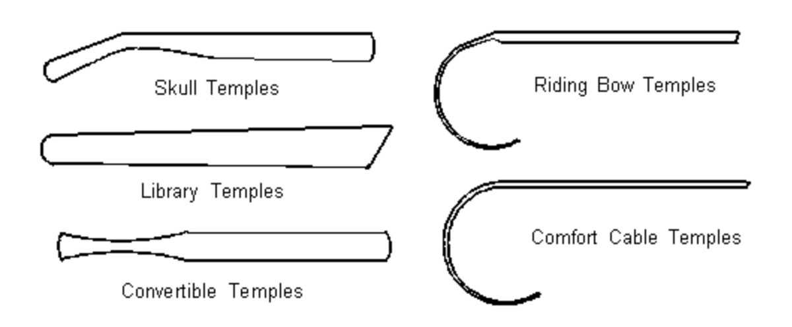
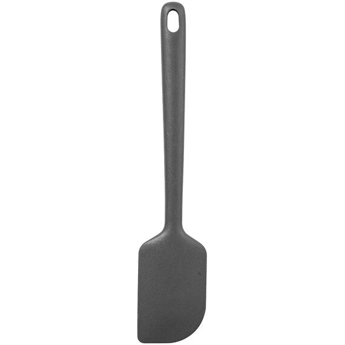

tags:: Feature
alias:: frame-temple

- Temples are part of the frame
  id:: 67fc1b60-2188-40d6-ae64-63279365f560
- They usually come in pairs
- The temples support the frame on wearer's face by resting on their ears
	- Some temple designs might feature *temple tips*, which provides better ear-hugging or comfort
- # Adjustability
  id:: 67fc1efe-be95-4894-ac6d-d23b5925d41a
	- Temples are usually **adjustable** or **malleable**, to enable better fit
		- Early temples come with thin [metal]([[Metal]]) temple, usually called *wire* or *cable* temples
			- Popular metal or alloys used for temples are usually
				- [[Silver]]
				- [[Gold]]
				- [[Steel]]
				- Titanum
			- A #1920s frame with springy cable temples
			  
		- Some non-cable [metal temple]([[Metal]]) is also adjustable by simply bending the part
		- [Acetate temple]([[Acetate]]) can be shaped when applied with heat, like with [[AO Flexi-Fit]]
- # Types
  id:: 67fc1d47-967d-46f7-8cc5-9e6312a71c43
	- 
	- ## [[Skull temple]]
	  id:: 67fc1e62-0e5a-41b8-bedf-bde0271589e7
		- Bends down around the ears
		- Follows skull contour
		- Rests evenly against skull
	- ## [[Library temple]]
		- Is generally straight
		- Does not down around the ears
		- Holds weight mostly by pressing against the sides of the skull
	- ## [[Convertible temple]]
		- Can be used as either **Skill** or **Library**, depending on the [desired shape](((67fc1efe-be95-4894-ac6d-d23b5925d41a)))
	- ## [[Riding bow temple]]
		- Curve around the ears
		- Extends way down below the earlobes
		- Mostly used by athletic, children's, and [safety frames]([[Safety eyewear]])
	- ## [[Comfort cable temple]]
		- Like [riding bow]([[Riding bow]]), but with springy metal temple tips
- # Styles
	- Unlike [temple types](((67fc1d47-967d-46f7-8cc5-9e6312a71c43))) which are easily categorized, styles are informal ways of classifying temples based on its appearance
	- ## [[Spatula temples]]
		- 
		- Spatula temples are named after the kitchenware: spatula
		- It generally fashions enlarged temple tips (compared to the rest of the temple)
		- These enlarged temple tips might be bent to a degree, thus making them a subtype of ((67fc1e62-0e5a-41b8-bedf-bde0271589e7))
		- ### Subtypes
			- [[Spatula (fan tip)]]
				- The tips look like a fan blade